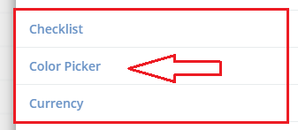
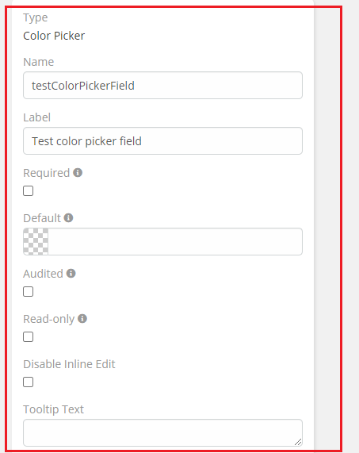
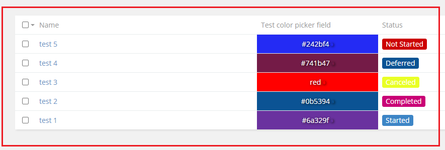

# Ebla Enum Color. Color Picker Field

#### this feature enables you to add a field color picker.

### How to use it

1. go to **Admin** -> **Entity Manager** -> **Scope** -> **Fields** -> **Add Field** -> **Color Picker**.

### Result:

