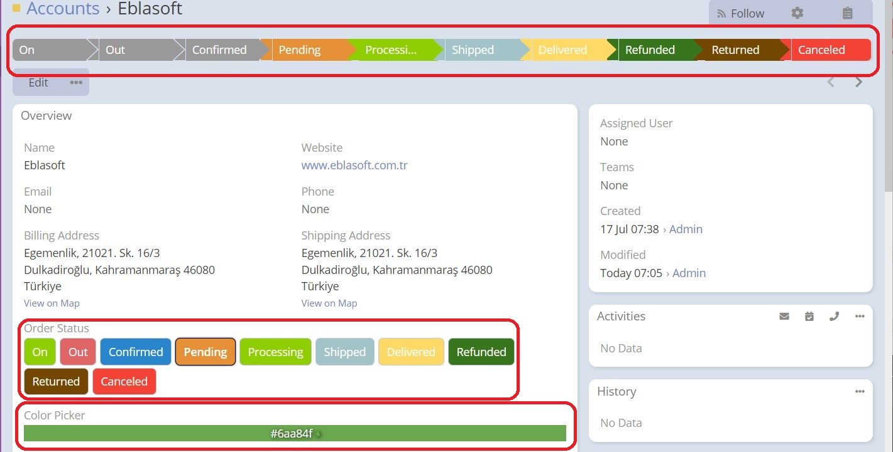

# Espocrm Enum Plus

---

<ins class= "font1" > Version:</ins> 2.1.0
<ins class= "font1" > Supported EspoCRM Versions:</ins> >=7.5.0
<ins class= "font1" > Type:</ins> paid

## Overview

> This extension enhances the existing **Enum** field type in espocrm. It gives you the ability to select extra colors for your options, shows them as buttons, and other more [features](/extensions/ebla-enum-plus/README?id=features).

## Features

1. **[Enum source list:](/extensions/ebla-enum-plus/espocrm-ebla-enum-plus-features.md?id=enum-source-list)** define enum options globally to be reused anywhere.

2. **[Enum extra colors:](/extensions/ebla-enum-plus/espocrm-ebla-enum-plus-features.md?id=enum-extra-colors)** enjoy unlimited colors for options.

3. **[Color picker field type:](/extensions/ebla-enum-plus/espocrm-ebla-enum-plus-features.md?id=color-picker-field-type)** can be added to entities from entity manager.

4. **[Enum as buttons:](/extensions/ebla-enum-plus/espocrm-ebla-enum-plus-features.md?id=enum-as-buttons)** enum options will be rendered as buttons (support enum & m. enum).

## How to Install

You can install this extension following the steps in [EspoCRM Documentation](https://docs.espocrm.com/administration/extensions/).

---

###  [CHANGELOG](extensions/ebla-enum-plus/espocrm-ebla-enum-plus-changelog.md)  {docsify-ignore}