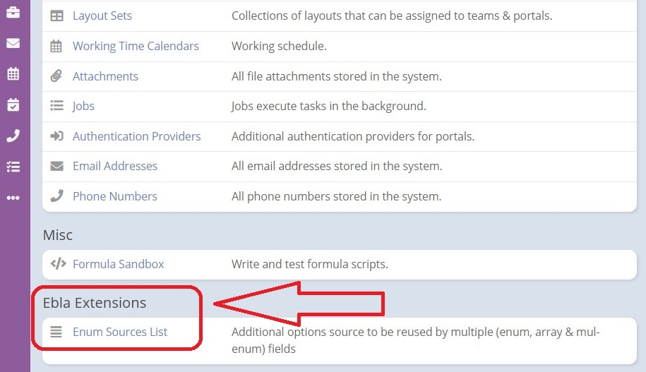

## Features

### Enum source list:

Define enum options in **"Enum Sources List"** globally to be reused anywhere.

### Enum extra colors:

Enjoy unlimited colors for options.

### Color picker field type:

Can be added to entities from entity manager.

### Enum as buttons:

Enum options will be rendered as buttons (support enum & m. enum).

### Kanban status bar:

Kanban status bar enable on detail view.

Edit Scope: Enable / Disable Kanban Status Bar in Detail View 

Detail view :

