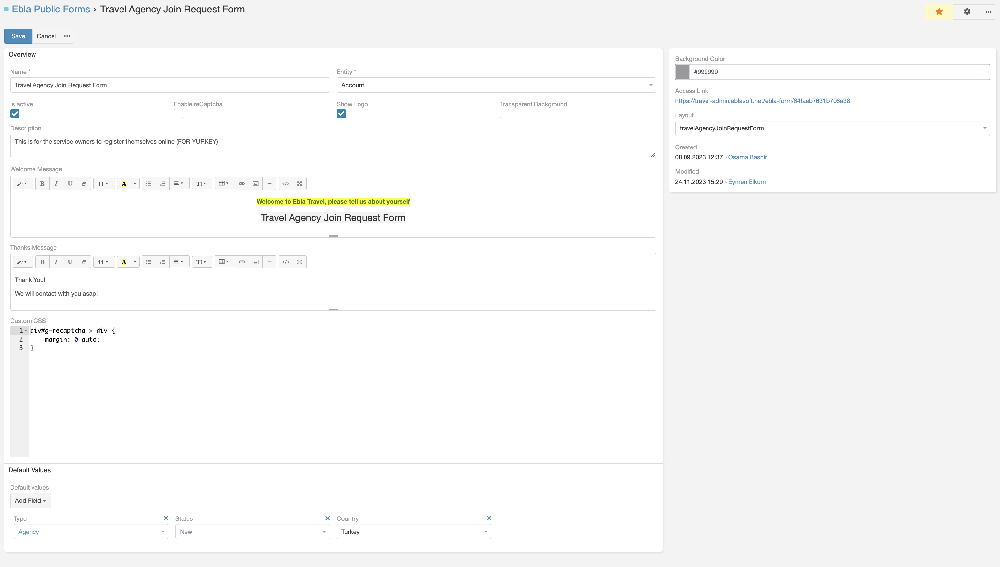

#  Public Forms 

> Public forms for EspoCRM can be embedded in IFrames to your website or sent as links via emails.
> is available in [Ebla Public Forms](https://www.eblasoft.com.tr/espocrm-extension-page/feedback-forms).

---

---

**-** Go to **Administration** -> **Ebla Public Form Defs** -> **Create Ebla Public Form**.

 

###  [ChangeLog](changelog.md) 
