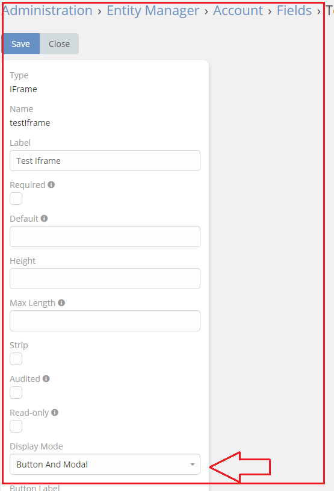
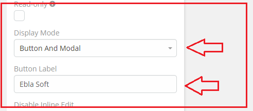
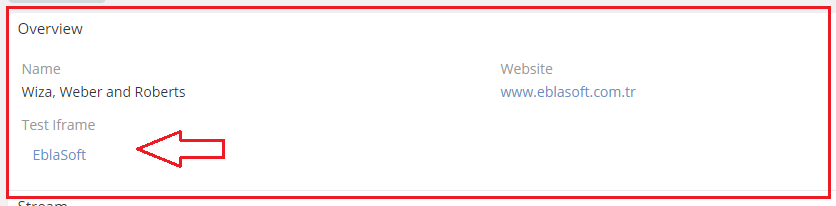
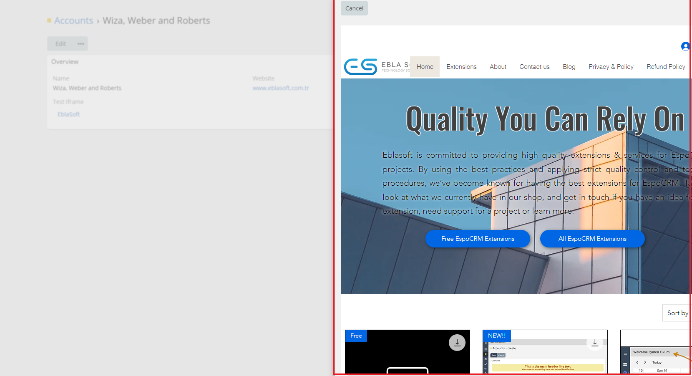

# Ebla IFrame . Button And Model

#### This feature allows you to customize the name of your link. This can make it more user-friendly and easier to remember.

### How to use it

1. go to **Admin** -> **Entity Manager** -> **Scope** -> **Fields** -> **Add Field** -> **IFrame**.
2. Select **Button And Modal** in the **Display Mode** option.

3.**write the name of the link** .

### Result:

