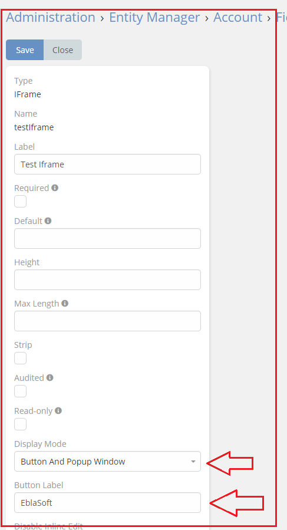
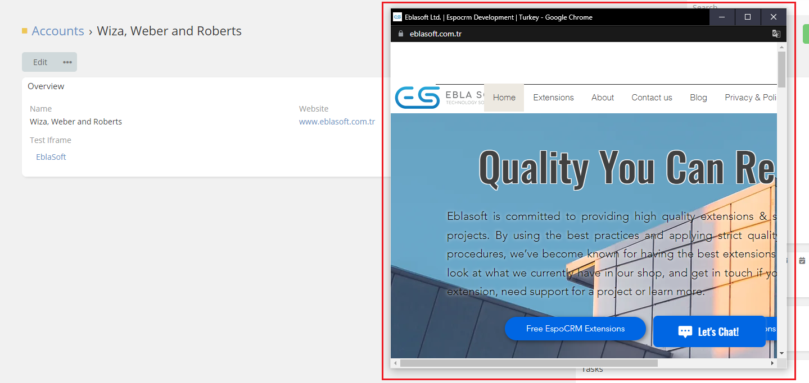

# [Ebla IFrame.](../setting-up.md) Button And Popup Window

**This feature allows you to customize the name of your link.**

**This can make it more user-friendly and easier to remember.**

 **Displayed by popup Window.**

### How to use it

1. go to **Admin** -> **Entity Manager** -> **Scope** -> **Fields** -> **Add Field** -> **IFrame**.
2. Select **Button And Popup Window** in the **Display Mode** option.
3. **write the name of the link** .

### Result:

