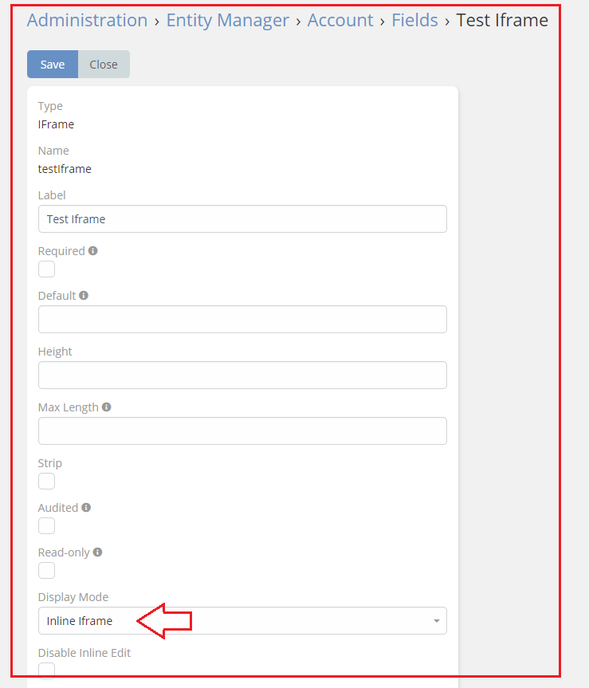
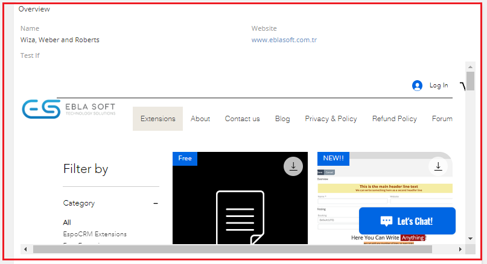

# Ebla IFrame . Inline IFrame

#### This feature allows you to seamlessly integrate an iframe within the detail view , ensuring that it is displayed in line with the other fields.

### How to use it

1. go to **Admin** -> **Entity Manager** -> **Scope** -> **Fields** -> **Add Field** -> **IFrame**.

2. Select **Inline Iframe** in the **Display Mode** option.

### Result:

