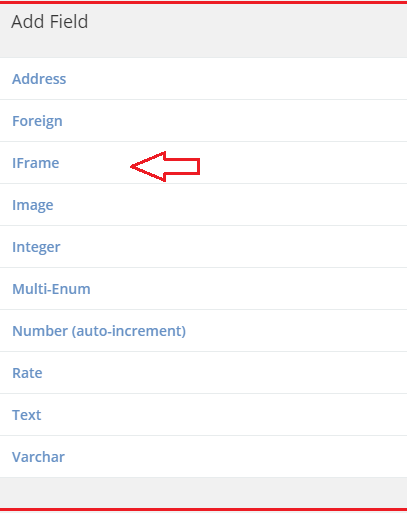
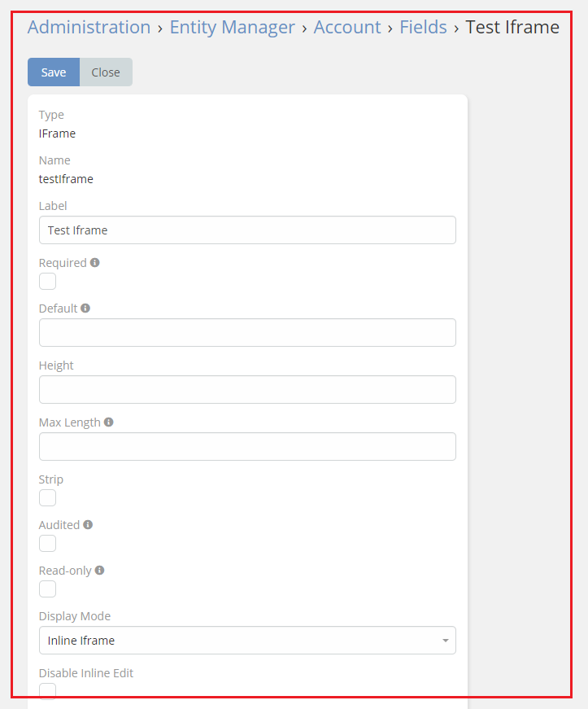
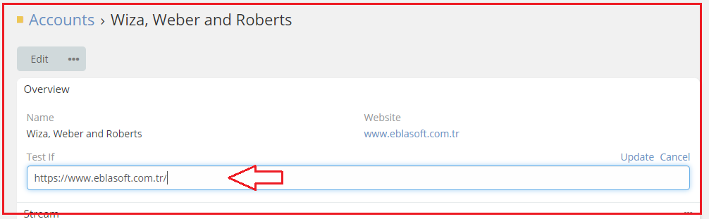

# [Ebla IFrame.](../setting-up.md) Iframe Field

 **this feature enables you to add a field IFrame .**

### How to use it

1. go to **Admin** -> **Entity Manager** -> **Scope** -> **Fields** -> **Add Field** -> **IFrame**.

2. Add your URL in the field.

### Result:

