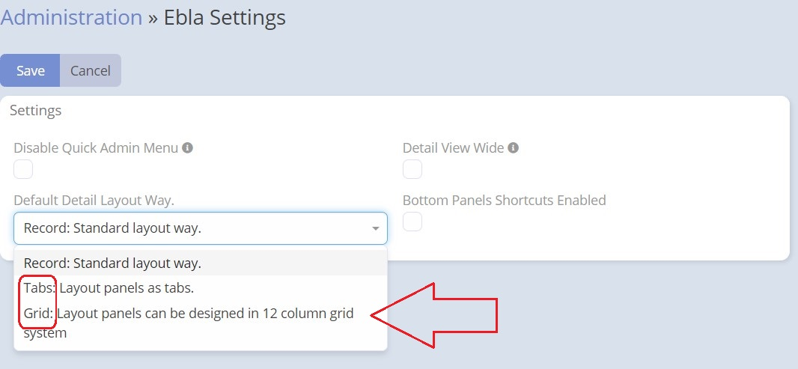
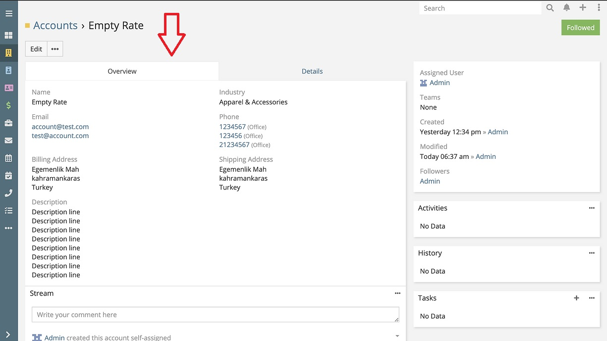
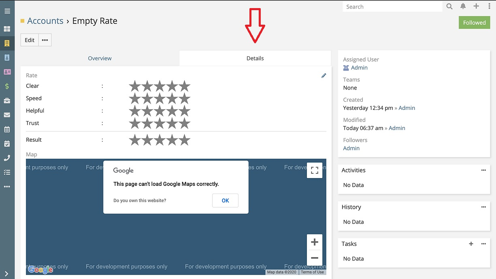
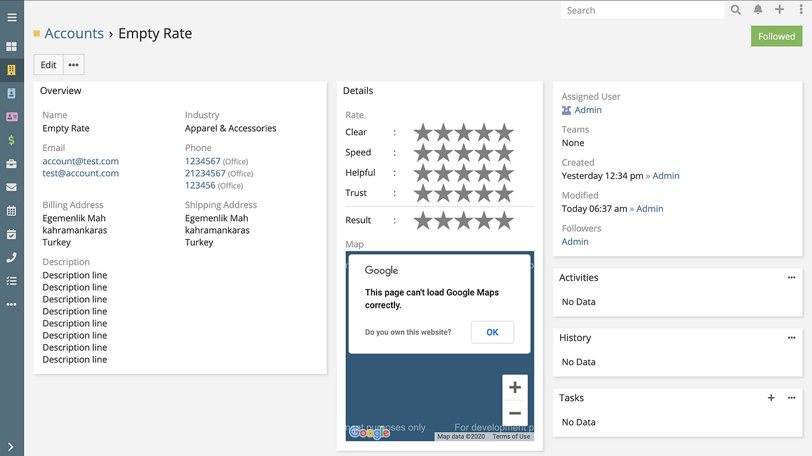
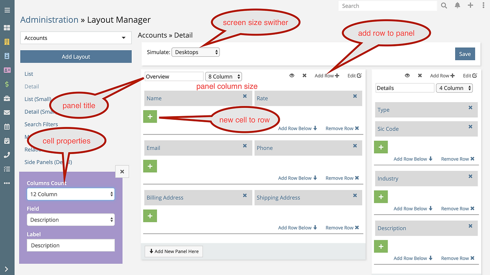
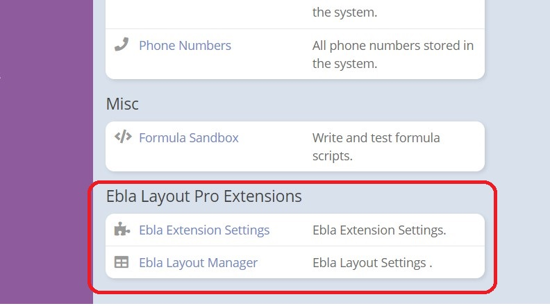

# Espocrm Layout Pro Extension 

---

<ins class= "font1" > Version:</ins> 4.2.1

<ins class= "font1" > Supported EspoCRM Versions:</ins> >=5.6.0 

<ins class= "font1" > Type:</ins> paid

## Description

> This extension is designed to integrate the power of the Bootstrap grid system into the detail view of EspoCRM. It introduces a new
 layout manager entry specifically for this purpose. By utilizing the new layout manager, you can take advantage of the 12-column
 feature provided by Bootstrap's grid system or the Tabs layout to create more complex layouts. If you would like to have a quick look you are welcomed to watch this [Youtube Short Video](https://www.youtube.com/watch?v=gqRNCmqEfV4) .

 

## Features

* ***Two Layout Options:*** The layout manager supports two layouts for panels:

    **1. "Tabs"** where panels are displayed as tabs.
    
    
    **2.  "Grid"** where panels are displayed as cells in a 12-column grid.
       

* ***Responsive Design:*** The layout manager supports different panel and cell column sizes based on screen sizes. These sizes include:
    - **"xs"** for phones (screens < 768px wide)
    - **"sm"** for tablets (screens >= 768px wide)
    - **"md"** for small laptops (screens >= 992px wide)
    - **"lg"** for laptops and desktops (screens >= 1200px wide).

* ***12-Column Grid:*** The layout manager supports a 12-column grid, allowing for more flexible panel and cell arrangements compared to the standard 4-column grid used in the "espo" CRM.

* ***Variable Cell Sizes:*** Unlike the standard "espo" CRM, the layout manager supports different cell sizes within the grid layout, providing more flexibility in arranging and sizing the panels.

* ***List and Detail Layouts:*** The layout manager introduces new list and detail layouts for entities. Additionally, there is an option called **"isWide"** that allows for a full-width detail layout. This option can be set at the CRM level and overridden at the layout level.

* ***Different Layout Types:*** The layout manager allows for setting different layout types for each layout separately, providing customization options for different views.

* ***Different List Layout for Bottom Relationships:*** The layout manager supports setting a different list layout specifically for bottom relationships, enabling distinct display options for these relationships.

* ***Font Color for Fields:*** The layout manager includes the ability to set font colors for fields, allowing for customized text appearance.

* ***Font Bold for Fields:*** In addition to font color, the layout manager supports setting the font weight to bold for fields, providing emphasis and visual distinction.

* ***Wide Views:*** The layout manager introduces a "Wide Views" option that can be set globally or on a per-view basis. This option allows for swapping the side panel to the bottom, enabling a wider and more expansive view.

* ***Relationship Panel Shortcuts:*** Shortcut links for relationship panels are added to the top of the detail view, providing convenient access to related information.

* ***Layout Manager Enhancements:*** The layout manager includes a new button that allows for copying a layout from a full-width view to a smaller-sized view. This simplifies the process of adapting layouts across different screen sizes.

## Use Cases

- This Layout Pro Tool is very helpful to show and to use more datafeeds.
- this is also very helpful for design of sides and the daily work to arrange complex information with Espo.

## How to Install

You can install this extension following the steps in [EspoCRM Documentation](https://docs.espocrm.com/administration/extensions/).

After installing the extension, you will notice a new section in the administration panel called "Ebla Extension." This section is specifically dedicated to managing the features and settings related to the extension.

## CHANGELOG

+ layout-pro-v2.0.0: (12.10.2019)
    - 100% safe upgrade

+ layout-pro-v2.2.1: (29.02.2020)
    - respect fullWidth from the standard layout

+ layout-pro-v2.2.2: (19.05.2020)
    - fix issue after update espocrm to 5.9.1

+ layout-pro-v2.2.3: (08.06.2020)
    - fix issue not change panel name

+ layout-pro-v2.3.0: (08.06.2020)
    - Ability to add layouts

+ layout-pro-v2.3.1: (14.06.2020)
    - Fix compatibility with different versions of espocrm

+ layout-pro-v2.3.2: (18.06.2020)
    - Skip tab layout for the small details

+ layout-pro-v2.3.3: (21.06.2020)
    - respect espo columns > 2 by default

+ layout-pro-v2.4.0: (5.08.2020)
    - Feature: isWide option

+ layout-pro-v2.5.0: (5.08.2020)
    - Feature: layout-pro: is wide & layout type can be set per scope

+ layout-pro-v2.5.1: (6.08.2020)
    - fix layout-pro-v2.6.0: (7.08.2020)
    - fields color

+ layout-pro-v2.6.1: (7.08.2020)
    - apply fields color on edit mode for inputs

+ layout-pro-v2.7.0: (7.08.2020)
    - field bold option

+ layout-pro-v2.7.3: (8.08.2020)
    - fixes & improvements

+ layout-pro-v2.7.4: (8.08.2020)
    - improvement color palette

+ layout-pro-v2.8.0: (8.08.2020)
    - new feature!! set custom layouts for bottom panels

+ layout-pro-v2.8.2: (19.08.2020)
    - color fields minor improvements

+ layout-pro-v2.9.0: (19.08.2020)
    - remove toggle field

+ layout-pro-v2.9.1: (25.09.2020)
    - skip isWide for modal views

+ layout-pro-v3.0.0: (02.10.2020)
    - espo-v6.0.0 compatibility.

+ layout-pro-v3.0.2: (14.10.2020)
    - admin panel key words

+ layout-pro-v3.1.0: (28.10.2020)
    - espo version 6 compatibility

+ layout-pro-v3.1.1: (12.11.2020)
+ layout-pro-v3.1.2: (13.11.2020)
+ layout-pro-v3.1.3: (14.11.2020)
    - fixes & improvements

+ layout-pro-v3.2.2: (09.02.2021)
    - make it work for espo-v5.6.* and above
    - minor improvements
    - fix layout manage not open scope after first load

+ layout-pro-v3.4.0: (13.10.2021)
    - fix: tabs panels to support panel dynamic logic
    - tabs fix break line when tabs different rows number

+ layout-pro-v3.5.0: (17.10.2021)
    - entity manager quick link

+ layout-pro-v3.6.3: (14.02.2022)
    - Espo 7 upgrade
    - Fix panel label not save

+ layout-pro-v3.7.0: (22.08.2022)
    - add relationship panels shortcuts to the top of detail view

+ layout-pro-v3.8.0: (07.09.2022)
    - code files headers

+ layout-pro-v3.9.0: (28.09.2022)
    - Espo 7.2.* compatibility

+ layout-pro-v4.0.0: (11.10.2022)
    - change extension name to ebla-layout-pro

+ layout-pro-v4.1.1: (11.10.2022)
    - layout manager new button "copy layout from full to small"
    - css minor fix

+ layout-pro-v4.1.3: (04.11.2022)
    - add missing tpl files
    - improve the entity manager button

+ layout-pro-v4.1.5: (16.01.2023)
    - remove scope list selector
    - fix back button bug

+ layout-pro-v4.2.0: (03.02.2023)
    - compatibility with Espo 7.3.0
    - fix "add layout" action

+ layout-pro-v4.2.1: (29.03.2023)
    - change button color
    - remove admin panel shortcut
    