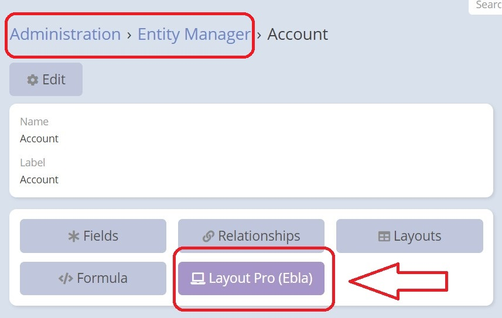
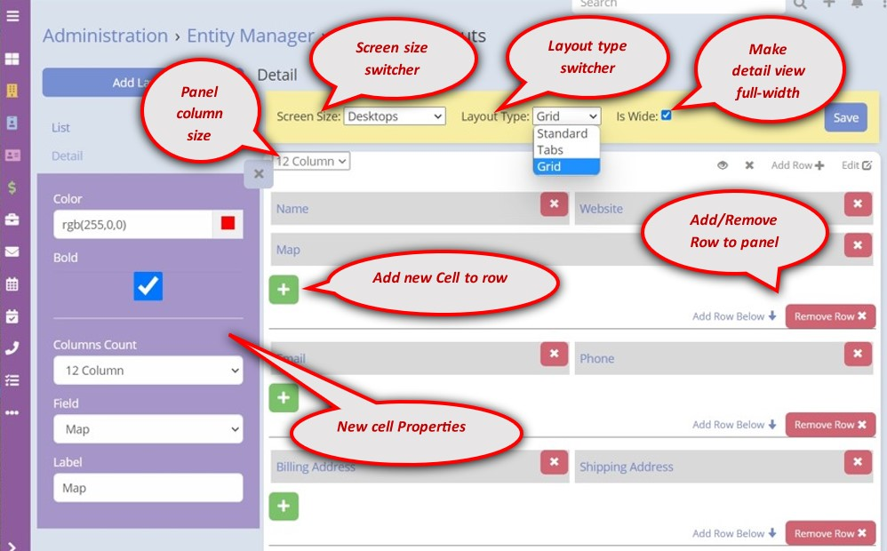

# Espocrm Layout Pro

---

<ins class= "font1" > Version:</ins> 4.2.1
<ins class= "font1" > Supported EspoCRM Versions:</ins> >=5.6.0
<ins class= "font1" > Type:</ins> paid

## Overview

This extension extend Espocrm layout manager with more power of the **[Bootstrap 12-column grid system](https://getbootstrap.com/docs/3.3/css/#grid-example-basic)** into the detail view of EspoCRM.
It enhances layouts with more [features](/extensions/ebla-layout-pro/README?id=features).

[Ebla Layout Pro](https://www.youtube.com/embed/gqRNCmqEfV4 ':include :type=iframe width=100% height=400px')

## Features

1. [Tabs Layout](extensions/ebla-layout-pro/espocrm-ebla-layout-pro-features.md).
2. [Grid Layout](extensions/ebla-layout-pro/espocrm-ebla-layout-pro-features.md).
3. Ability to set different sizes for different screen sizes
4. 12 columns (Espocrm support maximum 4 equals cells per row)
5. Wide Detail View
6. Ability to create additional layouts for details & lists
7. Field font color
8. Field font bold
9. Ability to set custom layouts for Bottom Relationships individually

## How to Install

You can install this extension following the steps in [EspoCRM Documentation](https://docs.espocrm.com/administration/extensions/).

## How To Use

By following these steps, you will be able to navigate to the entity manager, utilize the layout extension, and customize the layout for your selected entity:

**1.** Go to the **Administration->Entity Manager** section of your application.

**2.** Once you are in the Entity Manager, select the entity you want to work with. 

**3.** After selecting the entity, you should notice a new button called **"Layout Pro (Ebla)"** that has been added. Click on it to access the layout pro extension properties.

**4.** Within the layout pro extension, you have the option to add a new layout or edit the detail layout of the selected entity.

> **Important Note:** The extension provides a more advanced and flexible layout management system compared to the old layout manager, But if you have detail views that **don't** require complex layouts, you can still use the old layout manager for those views.

## CHANGELOG

+ layout-pro-v2.0.0: (12.10.2019)
    - 100% safe upgrade

+ layout-pro-v2.2.1: (29.02.2020)
    - respect fullWidth from the standard layout

+ layout-pro-v2.2.2: (19.05.2020)
    - fix issue after update espocrm to 5.9.1

+ layout-pro-v2.2.3: (08.06.2020)
    - fix issue not change panel name

+ layout-pro-v2.3.0: (08.06.2020)
    - Ability to add layouts

+ layout-pro-v2.3.1: (14.06.2020)
    - Fix compatibility with different versions of espocrm

+ layout-pro-v2.3.2: (18.06.2020)
    - Skip tab layout for the small details

+ layout-pro-v2.3.3: (21.06.2020)
    - respect espo columns > 2 by default

+ layout-pro-v2.4.0: (5.08.2020)
    - Feature: isWide option

+ layout-pro-v2.5.0: (5.08.2020)
    - Feature: layout-pro: is wide & layout type can be set per scope

+ layout-pro-v2.5.1: (6.08.2020)
    - fix layout-pro-v2.6.0: (7.08.2020)
    - fields color

+ layout-pro-v2.6.1: (7.08.2020)
    - apply fields color on edit mode for inputs

+ layout-pro-v2.7.0: (7.08.2020)
    - field bold option

+ layout-pro-v2.7.3: (8.08.2020)
    - fixes & improvements

+ layout-pro-v2.7.4: (8.08.2020)
    - improvement color palette

+ layout-pro-v2.8.0: (8.08.2020)
    - new feature!! set custom layouts for bottom panels

+ layout-pro-v2.8.2: (19.08.2020)
    - color fields minor improvements

+ layout-pro-v2.9.0: (19.08.2020)
    - remove toggle field

+ layout-pro-v2.9.1: (25.09.2020)
    - skip isWide for modal views

+ layout-pro-v3.0.0: (02.10.2020)
    - espo-v6.0.0 compatibility.

+ layout-pro-v3.0.2: (14.10.2020)
    - admin panel key words

+ layout-pro-v3.1.0: (28.10.2020)
    - espo version 6 compatibility

+ layout-pro-v3.1.1: (12.11.2020)
+ layout-pro-v3.1.2: (13.11.2020)
+ layout-pro-v3.1.3: (14.11.2020)
    - fixes & improvements

+ layout-pro-v3.2.2: (09.02.2021)
    - make it work for espo-v5.6.* and above
    - minor improvements
    - fix layout manage not open scope after first load

+ layout-pro-v3.4.0: (13.10.2021)
    - fix: tabs panels to support panel dynamic logic
    - tabs fix break line when tabs different rows number

+ layout-pro-v3.5.0: (17.10.2021)
    - entity manager quick link

+ layout-pro-v3.6.3: (14.02.2022)
    - Espo 7 upgrade
    - Fix panel label not save

+ layout-pro-v3.7.0: (22.08.2022)
    - add relationship panels shortcuts to the top of detail view

+ layout-pro-v3.8.0: (07.09.2022)
    - code files headers

+ layout-pro-v3.9.0: (28.09.2022)
    - Espo 7.2.* compatibility

+ layout-pro-v4.0.0: (11.10.2022)
    - change extension name to ebla-layout-pro

+ layout-pro-v4.1.1: (11.10.2022)
    - layout manager new button "copy layout from full to small"
    - css minor fix

+ layout-pro-v4.1.3: (04.11.2022)
    - add missing tpl files
    - improve the entity manager button

+ layout-pro-v4.1.5: (16.01.2023)
    - remove scope list selector
    - fix back button bug

+ layout-pro-v4.2.0: (03.02.2023)
    - compatibility with Espo 7.3.0
    - fix "add layout" action

+ layout-pro-v4.2.1: (29.03.2023)
    - change button color
    - remove admin panel shortcut
    