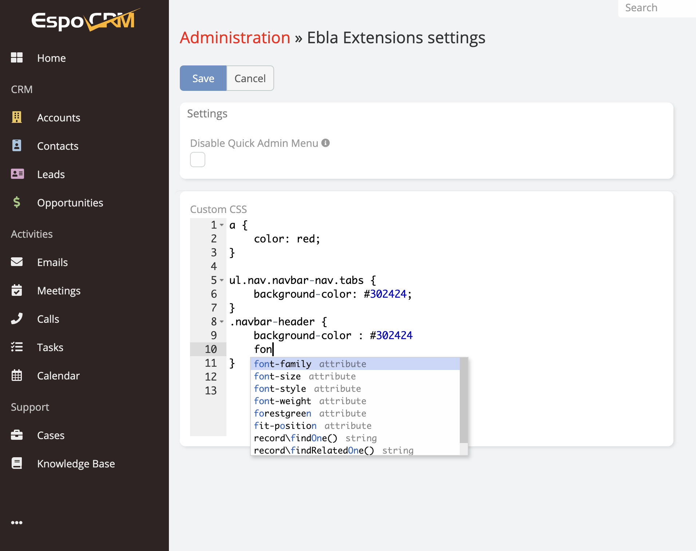

# Custom Css

Custom Css is available in [Ebla Layout Pro](https://www.eblasoft.com.tr/espocrm-extension-page/espocrm-layout-pro).

---

Ability edit any Css style class for EspoCRM.

** [Grid Layout](grid-layout.md)  |  [Changelog](changelog.md) **