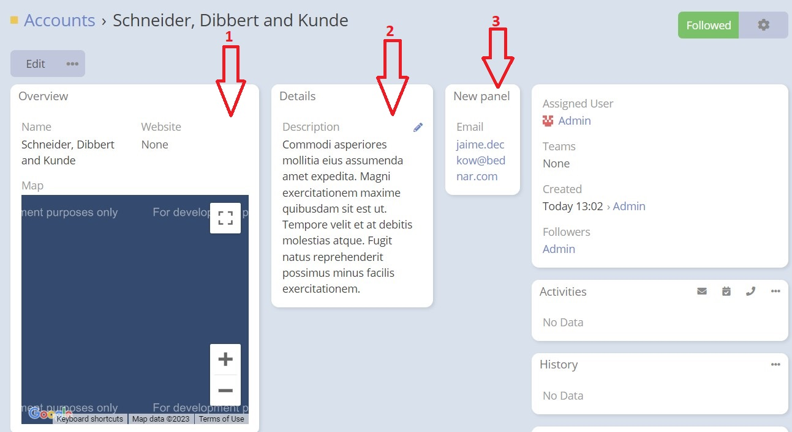
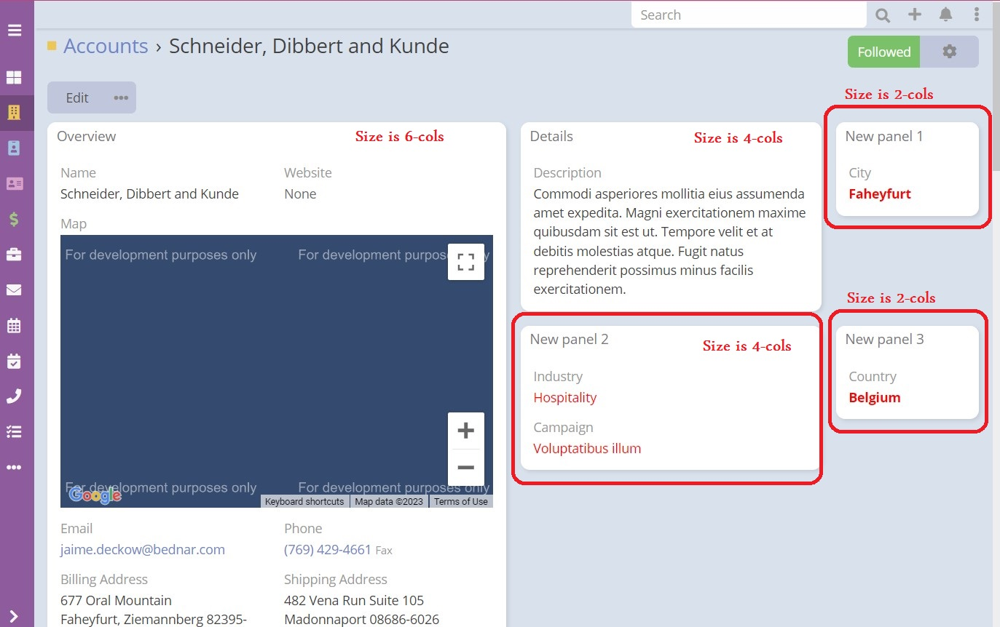
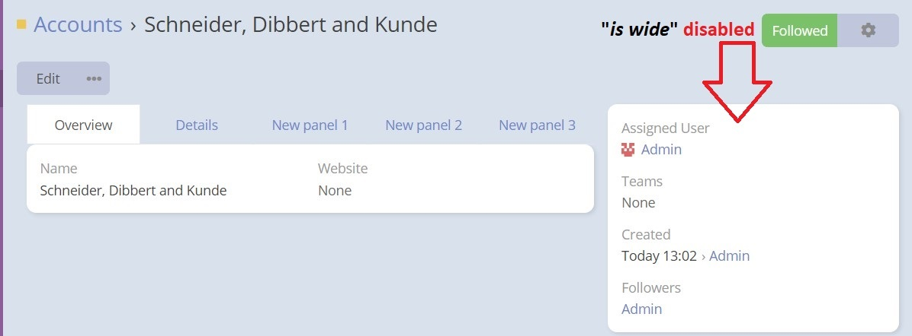
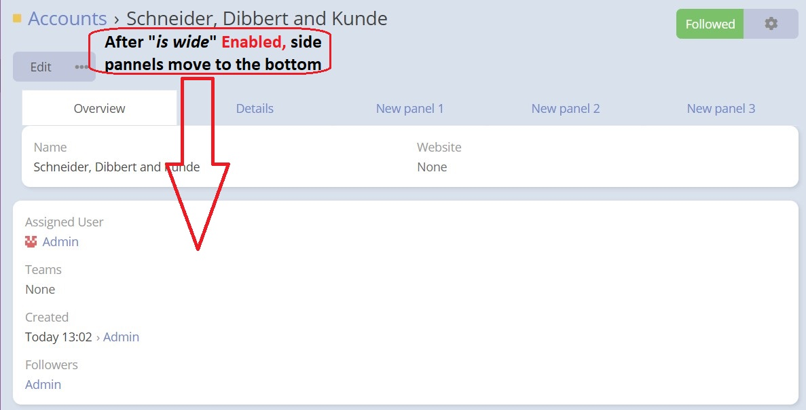

## Features

### 1. Tabs Layout
Here panels are displayed as tabs as in the picture.
NOTE: Espocrm started supporting tabs since

### 2. Grid Layout 

* ***"Grid"*** where panels are displayed as cells in a 12-column grid.
  

***2. Responsive Design:*** The layout manager supports different panel and cell column sizes based on screen sizes. These sizes include **"xs"** for phones (screens < 768px wide), **"sm"** for tablets (screens >= 768px wide), **"md"** for small laptops (screens >= 992px wide), and **"lg"** for laptops and desktops (screens >= 1200px wide).

***3. 12-Column Grid:*** The layout manager supports a 12-column grid, allowing for more flexible panel and cell arrangements compared to the standard 4-column grid used in the "espo" CRM when using the **Grid** layout type.

Variable Cell Sizes:*** Unlike the standard EspoCRM, extension supports different cell sizes within the grid layout, providing more flexibility in arranging and sizing the panels.

***5. Wide Views:*** The layout manager introduces option called **"isWide"** that allows for a full-width detail layout (It can be set globally or on a per-view basis). This option allows for swapping the side panel to the bottom, enabling a wider and more expansive view.
* **Before** "is wide" Enabled:
  

* **After** "is wide" Enabled:
  

***6. List and Detail Layouts:*** The layout manager introduces adding **new layout** which can be of type **"list"** or **"detail"** for entities.

***7. Different Layout Types:*** The layout manager allows for setting different layout types for each layout separately, providing customization options for different views.

***8. Different List Layout for Bottom Relationships:*** The layout manager supports setting a different list layout specifically for bottom relationships, enabling distinct display options for these relationships.

***9. Font Color for Fields***

***10. Font Bold for Fields***
