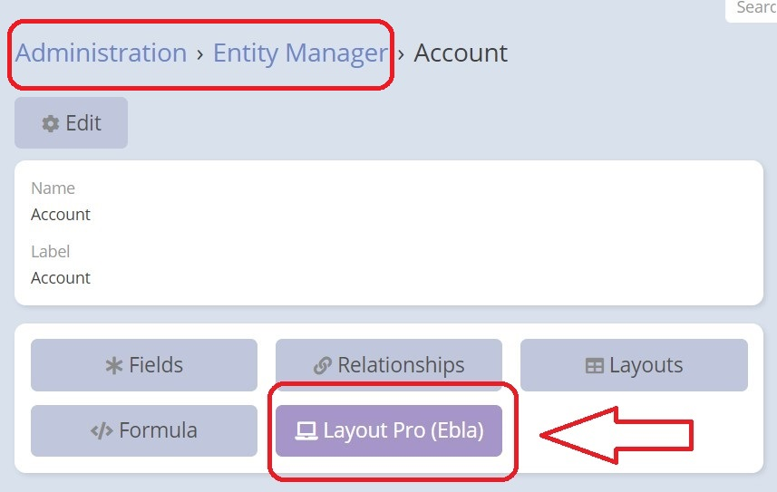

## How To Use

**1.** Go to the **Administration->Entity Manager** section of your application.

**2.** Once you are in the Entity Manager, select the entity you want to work with. 

**3.** After selecting the entity, you should notice a new button called **"Layout Pro (Ebla)"** that has been added. Click on it to access the layout pro extension properties.

**4.** Within the layout pro extension, you have the option to add a new layout or edit the detail layout of the selected entity.

> **Important Note:** The extension provides a more advanced and flexible layout management system compared to the old layout manager, But if you have detail views that **don't** require complex layouts, you can still use the old layout manager for those views.

