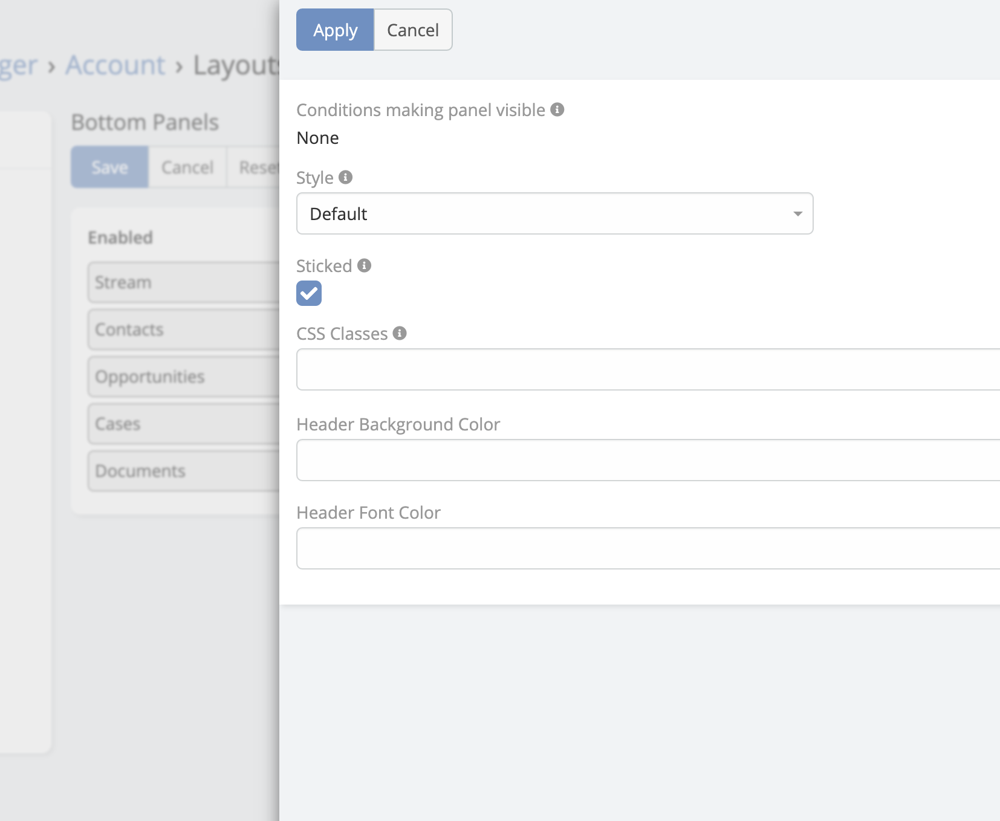
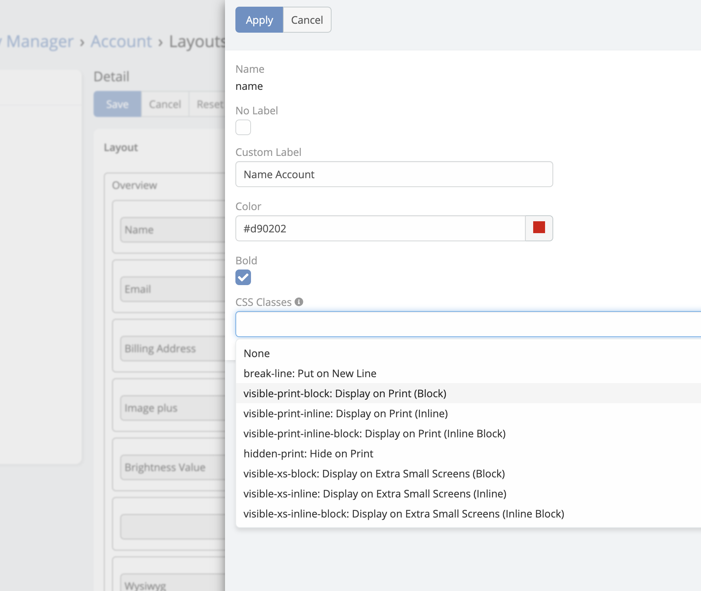
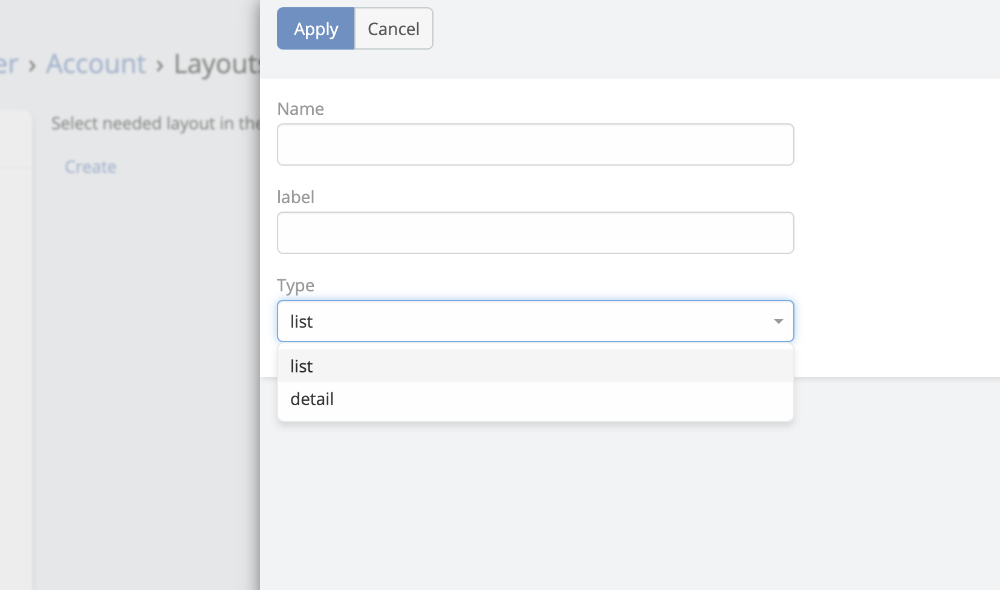

# Grid Layout

---

> This extension extend Espocrm layout manager with more power of
> the [Bootstrap 12-column grid system](https://getbootstrap.com/docs/3.3/css/#grid-example-basic) into the detail view
> of
> EspoCRM.

[Ebla Layout Pro](https://www.youtube.com/embed/ROrpILorBZk ':include :type=iframe width=100% height=400px')

### Another Features

* [12 columns](#12-columns)
* [Panel Customisation](#Panel-customisation)
* [Field Customisation](#field-customisation)
* [Bottom Panels Customisation](#bottom-panels-customisation)
* [Wide Detail View](#wide-detail-view)
* [Create Additional Layout (detail , list)](#create-additional-layout-detail--list)
* Ability to set custom layouts for Bottom Relationships individually

### 12 Columns

---

!!! note

    Espocrm support maximum 4 equals cells per row.

### Panel Customisation

---

1. CSS Classes
2. Header Background Color
3. Header Font Color

### Bottom Panels Customisation

---

### Field Customisation

---

1. No Label
2. Custom Label
3. Font Color
4. Font Bold
5. Css Class

### Wide Detail View

---

Administration-> Entity Manager-> **entityType**-> Edit

* Full Detail is Wide
* Small Detail is Wide  

### Create Additional Layout (detail , list)

---

!!! note

    Espocrm just support list layout.

