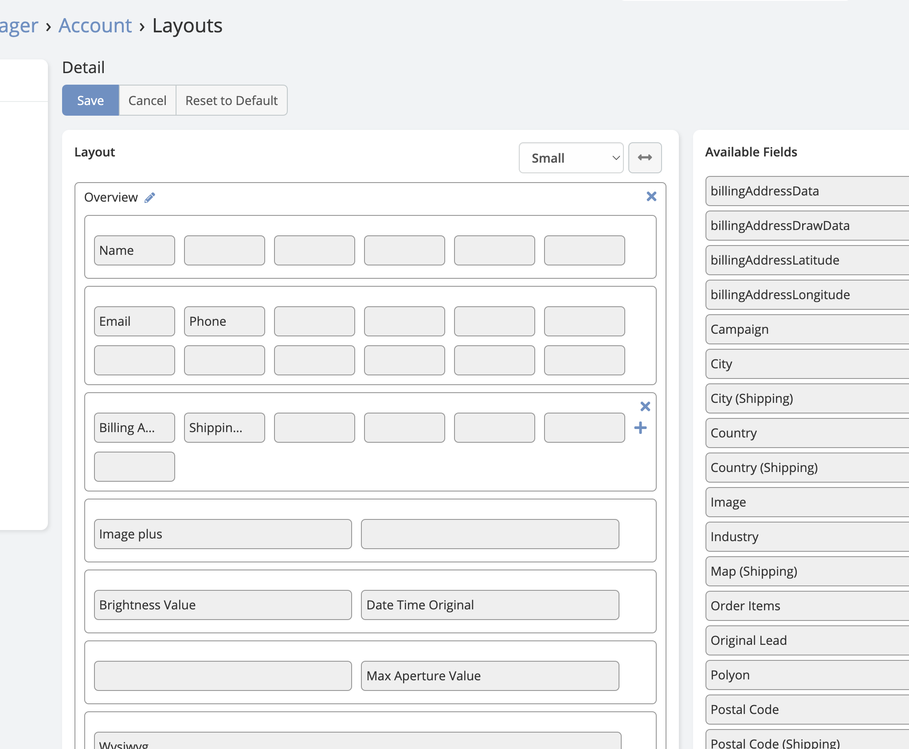
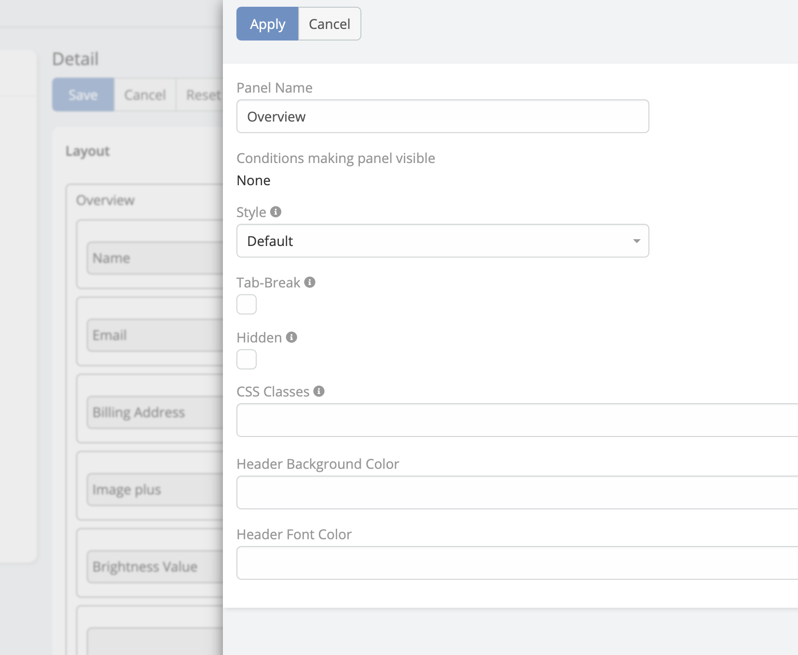

# Grid Layout

Gird Layout is available in [Ebla Layout Pro](https://www.eblasoft.com.tr/espocrm-extension-page/espocrm-layout-pro).

---

> This extension enhances the capabilities of EspoCRM's layout manager by incorporating the
> robust [Bootstrap 12-column](https://getbootstrap.com/docs/3.3/css/#grid-example-basic) grid system
> into the detail view.

<iframe width="650" height="315" src="https://www.youtube.com/embed/ROrpILorBZk" frameborder="0" allow="accelerometer; autoplay; clipboard-write; encrypted-media; gyroscope; picture-in-picture" allowfullscreen></iframe>

### Another Features

* [12 columns](#12-columns)
* [Panel Customisation](#Panel-customisation)
* [Field Customisation](#field-customisation)
* [Bottom Panels Customisation](#bottom-panels-customisation)
* [Wide Detail View](#wide-detail-view)
* [Create Additional Layout (detail , list)](#create-additional-layout-detail--list)

### 12 Columns

---

!!! note

    EspoCRM support maximum 4 equals cells per row by default.

### Panel Customisation

---

1. CSS Classes
2. Header Background Color
3. Header Font Color

### Bottom Panels Customisation

---

1. CSS Classes
2. Header Background Color
3. Header Font Color

### Field Customisation

---

1. No Label
2. Custom Label
3. Font Color
4. Font Bold
5. Css Class

### Wide Detail View

---

Administration-> Entity Manager-> **entityType**-> Edit

* Full Detail is Wide
* Small Detail is Wide

### Create Additional Layout (detail , list)

---

!!! note

    EspoCRM just support list layout by default.

###  [CHANGELOG](changelog.md) 