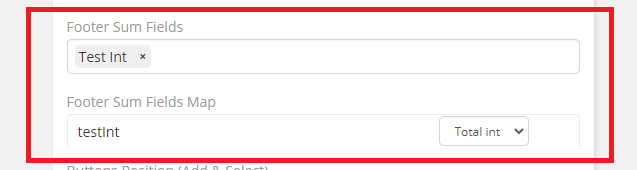
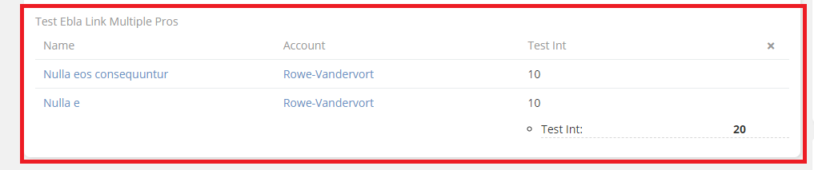
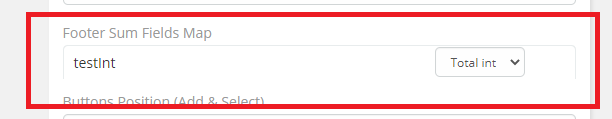
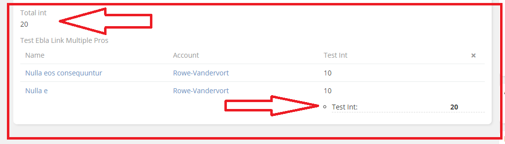

# Ebla Link Multiple Pro. Footer Sum

This feature allows you to choose the fields on which you want to perform the sum operation.

## How to use it

1. select fields .

 
result:

## The Features

1. Footer Sum Fields Map

This feature enables you to select the fields on which you wish to perform the parent sum operation.

## How to use it

1. select fields From parent  .

## Result:

