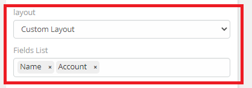
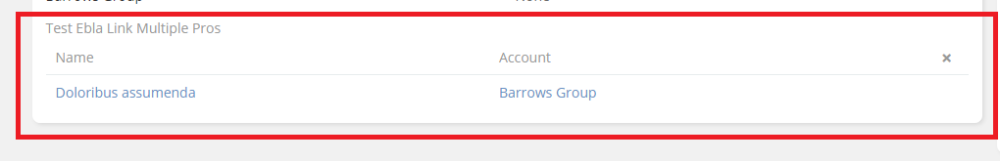

# Ebla Link Multiple Pro. Custom Layout

This feature enables you to pick the fields that will be displayed in the list view.

## How to use it

1. select Custom Layout from the layout drop-down list.
2. select the fields that you want to display in the list view.

## Result:

