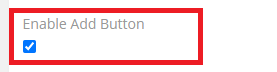
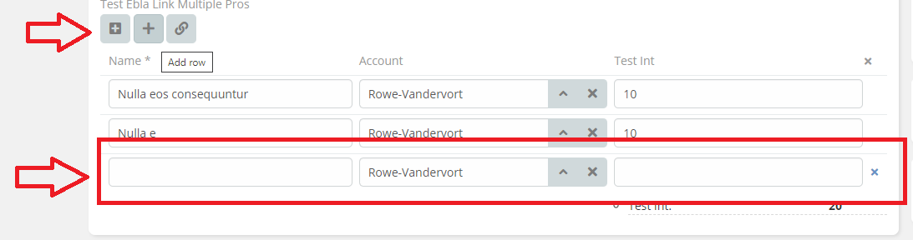
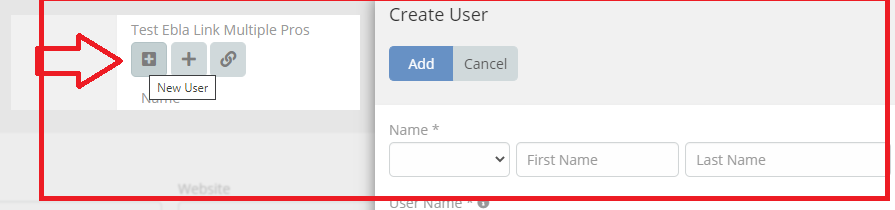

# Ebla Link Multiple Pro . Add Button

This feature enables you to add an "Add" button to add row  record.

## How to use it

1. Enable the "Add Button".

## Result:

* Click on the "Add" button to add a new row.

* Click on the "New Record" button to add a new record.

