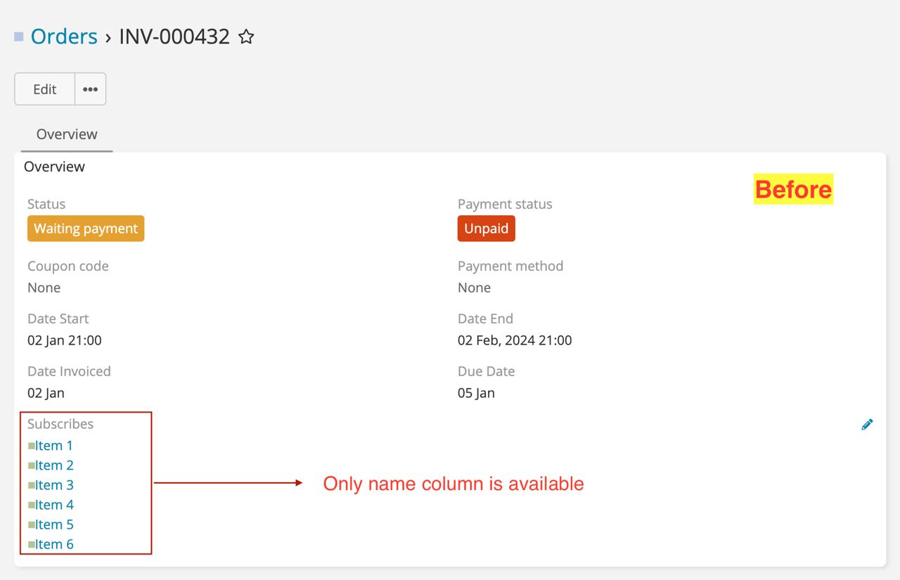
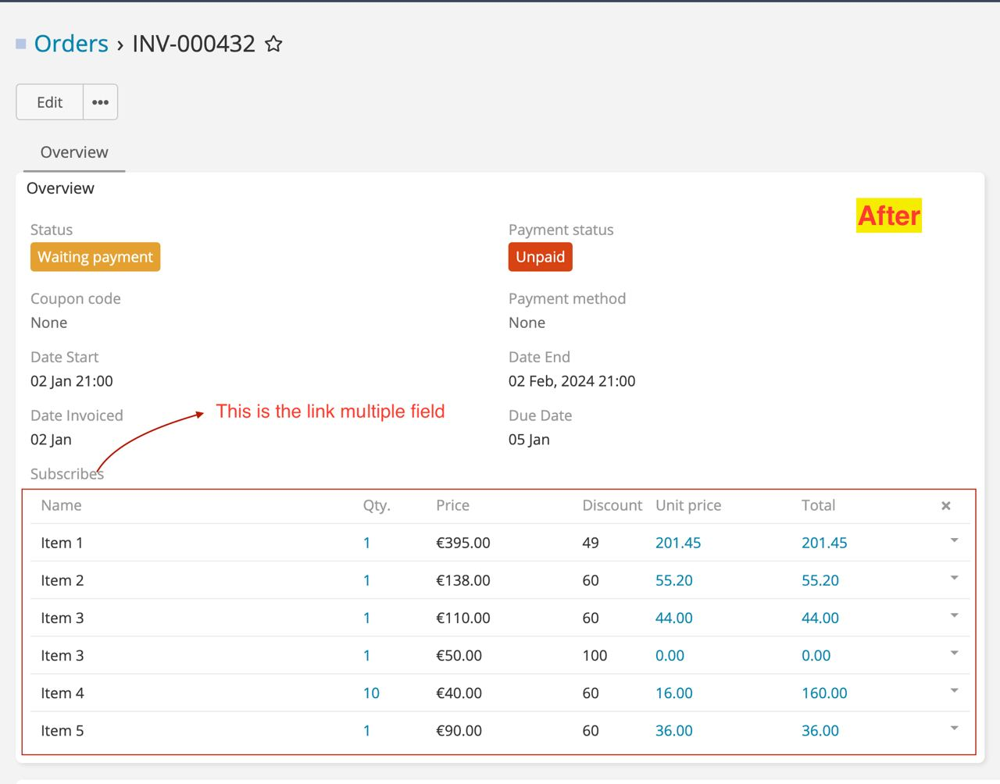
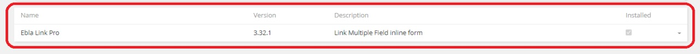
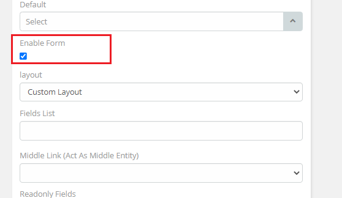
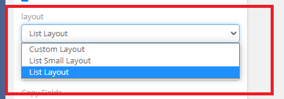
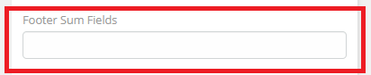
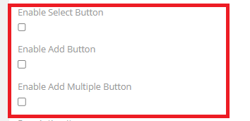
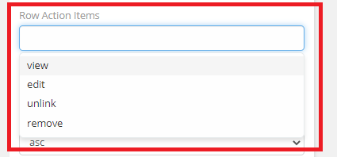

# Ebla Link Multiple Pro.

#### Type: Extension

[//]: # (#### [Youtube Video]&#40;https://youtu.be/fvllcGJhKNg&#41;.)

#### [Demo](https://demo.eblasoft.com.tr/#Task/create)

#### This extension enhance the link multiple field with ability to show any other field just like any list view.

#### It is utilized across various systems that involve invoice management, including pharmacies, warehouses, companies, medical clinics, restaurants, hotels, tourism companies, and banking systems.

* Order & order lines
* Shipment & shipment lines (items)
* Real estate property & owner-sips with owner rates

[//]: # (change with)

<iframe width="560" height="315" src="https://www.youtube.com/embed/fvllcGJhKNg" frameborder="0" allow="accelerometer; autoplay; clipboard-write; encrypted-media; gyroscope; picture-in-picture" allowfullscreen></iframe>

##  Before  and  After  using the extension.

#

## Enable Extension :

After installation do the following steps.
// make red txt

**1\.** Go to the   **Administration**  > **entityManager** > **Scope** > **Relationships**
.

**2\.** Enable **Link Multiple Field** .

**3\.** Go to Fields links name

**Administration**  > **entityManager** > **Scope** > **Field Link Name**
and **Enable Form**.

## The Features

### **1\.** layout

* [Custom Layout](layout/custom-layout.md).
* [List Small Layout](layout/list-small-layout.md).
* [List Layout](layout/list-layout.md).

### **2\.** Middle Link (Act As Middle Entity)

* Assigned User.
* Created By.
* Modified By.

### **3\.** Readonly Fields

* Make field readOnly.

### **4\.** Footer Sum Fields

* [Makes a sum of all the fields](footer-sum/footer-sum.md).

### **5\.** Buttons Position (Add & Select)

* Select button position.

### **6\.** Select Buttons

* [Enable select button](select-buttons/select-button.md) .
* [Enable add button](select-buttons/add-button.md) .
* Enable add multiple button .

### **7\.** Row Action Items

* [view](row-action-items/view.md).
* [edit](row-action-items/edit.md).
* [remove](row-action-items/remove.md).
* [unlink](row-action-items/unlink.md).

