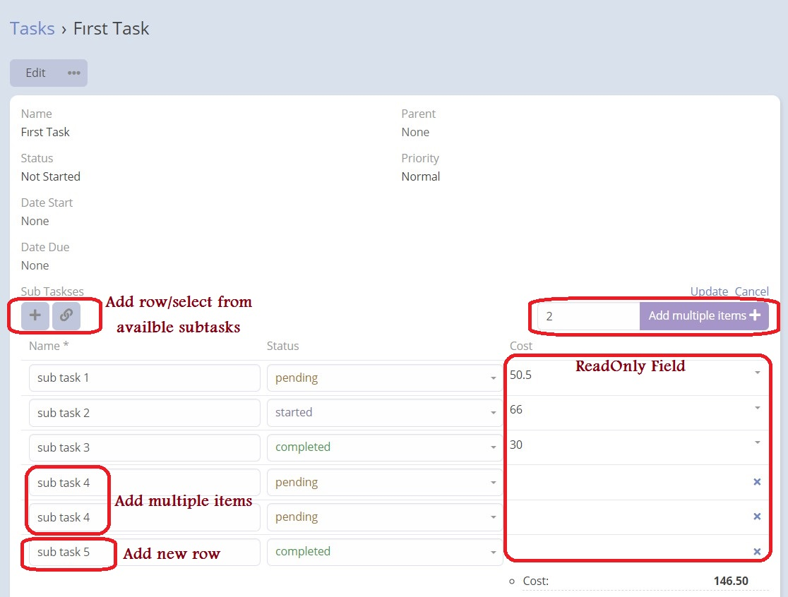
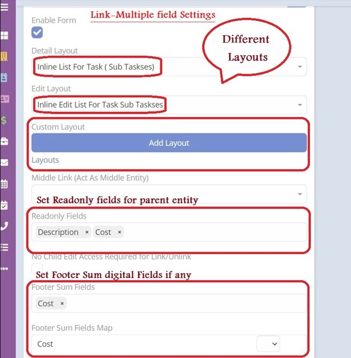
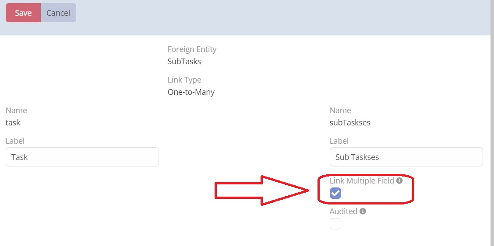

# Espocrm Link Multiple Pro

---

<ins class= "font1" > Version:</ins> 3.36.6 

<ins class= "font1" > Supported EspoCRM Versions:</ins> >=7.0.8 , <=7.4.20

<ins class= "font1" > Type:</ins> paid

## Description
> Basically this extension allows you to render link multiple fields in the list view

[Ebla Link Multiple Pro](https://www.youtube.com/embed/fvllcGJhKNg ':include :type=iframe width=100% height=400px')

## Problem
Espocrm only shows the names of linked entities.

## Solution
This extension allows you to show any field from the linked entity in the detail view.

## Features
***1.*** Ability to **inline edit** directly from the inline list.

***2.*** Ability to have **additional list layouts** for the linked entity.

***3.*** Ability to have **different layouts** for edit and detail modes.

***4.*** Ability to use **"Middle Link"** which acts as middle entity.

***5.*** Ability to enable the option **"No Child Edit Access Required for Link/Unlink"**

***6.*** Ability to add **footer sum fields** when having digital fields.

***7.*** Ability to choose of the following options **"view, edit, remove, unlink"**.

> **Important Note:** For   "Many To Many"  usage cases please consider to read [this article](https://www.eblasoft.com.tr/post/link-multiple-pro-many-to-many).

## Use Cases
- Invoice items on invoice entity

## How to Install

You can install this extension following the steps in [EspoCRM Documentation](https://docs.espocrm.com/administration/extensions/).

## How To Use

Following these steps will allow you to create a relationship between two entities, enable a multiple link field, configure its settings, and view and interact with the field in the parent entity's detail record:

**1.** Create a relationship between two entities of type one-to-many. Make sure to enable the "link multiple field" option to enable this extension.

**2.** After enabling the "link multiple field" option, a new field of type "link multiple" will be added to the fields of the parent entity. You can find this field in the entity manager.

**3.** Edit the properties of the newly added multiple link field. You will now see a new option called "enable form" available.

**4-** Check the "enable form" option and configure the desired settings for this field. Once you are done, save the changes.

**5.** To verify your configuration, view the detail record of the parent entity that has this multiple link field. You should be able to see the changes you have made and interact with the multiple link field accordingly.

## CHANGELOG

+ crm-plus-1.6.0: (14.10.2019)
    - add unlink row action
    - field manager: fields required only if layout = custom
    - field-manager: hide the holder field from the fields list

+ crm-plus-1.7.0: (06.02.2020)
    - fix 404 error

+ crm-plus-1.8.0: (06.02.2020)
    - fix row actions (unlink & remove)

+ crm-plus-1.9.0: (06.02.2020)
    - fix not render if first time loaded with empty list

+ crm-plus-2.0.0: (22.05.2020)
    - separate from mask field.

+ crm-plus-2.0.1: (22.05.2020)
    - fix issue on espocrm ^v5.9.0 was show additional select modal

+ crm-plus-2.1.0: (13.07.2020)
    - code improvements
    - fix cell overflow
    - fix & improve unlink / remove row actions for the not yet saved rows
    - validate entire fields
    - fields default values
    - required validation

+ crm-plus-2.1.1: (14.07.2020)
    - fix extension name

+ crm-plus-2.1.2: (14.07.2020)
    - fix validation.

+ crm-plus-2.1.3: (16.07.2020)
    - add list options to the view class (for developers)

+ crm-plus-2.2.0: (12.08.2020)
    - improve the field options visibility in field manager
    - Control row actions items [unlink, edit, view] from the field manager

+ crm-plus-2.2.1: (12.08.2020)
    - Control buttons (add, select) positions (top, bottom) from the field manager

+ crm-plus-2.3.0: (14.08.2020)
    - ability to add n items in one step

+ crm-plus-2.4.2: (15.09.2020 - 12.11.2020)
    - set collection max size from crm config
    - stop setting the assigned user from the parent entity.
    - fixes & improvements

+ crm-plus-2.5.0: (21.11.2020)
    - enable add option
    - enable add multiple option
    - fixes & improvements

+ crm-plus-2.6.0: (06.12.2020)
    - middle link option for many to many

+ crm-plus-2.7.0: (07.12.2020)

+ crm-plus-2.7.2: (13.12.2020)
    - footer sum

+ crm-plus-2.8.0: (19.12.2020)
+ crm-plus-2.8.1: (27.12.2020)
+ crm-plus-2.8.2: (07.01.2021)
    - quick row action "delete" in edit mode
    - css improves
    - fix readonly fields validation

+ crm-plus-2.9.1: (04.02.2021)
    - hide row action when "read only"
    - hide row action when inline edit disabled
    - middle link improvement

+ crm-plus-2.10.0: (06.02.2021)
+ crm-plus-2.10.2: (10.02.2021)
    - trigger "change" event when row deleted or updated by modal
    - disable full form for modal edit
    - fixes & improvements

+ crm-plus-2.11.0: (10.02.2021)

+ crm-plus-2.11.6: (23.02.2021)
    - add * symbol for required fields
    - fixes & improvements

+ crm-plus-2.12.0: (07.04.2021)

+ crm-plus-2.12.1: (14.04.2021)
    - fixes & improvements

+ crm-plus-2.13.3: (28.04.2021 - 14.05.2021)
    - copy fields
    - fix: error when has readOnly fields
    - disable ordering when edit mode
    - code option: "requiredFields"

+ crm-plus-2.14.1: (04.06.2021 - 06.06.2021)
    - Duplicate entity will duplicate the list

+ crm-plus-2.15.0: (15.07.2021)
    - Additional + button when Middle scope enabled

+ crm-plus-2.16.0: (15.07.2021)
    - new option to select sum footer fields
    - support currency fields on sum footer
    - fixes & improvements

+ crm-plus-2.17.0: (15.07.2021)
    - fixes read only dynamic logic losing list data.

+ crm-plus-3.18.2: (14.10.2021)
    - Espo 7 compatibility

+ crm-plus-3.19.2: (25.10.2021)
    - Apply fields ACL (read & write)

+ crm-plus-3.19.5: (29.11.2021)
    - Extendability improvement

+ crm-plus-3.20.0: (13.12.2021)
    - Support 6 & 7 on same time

+ crm-plus-3.21.1: (21.12.2021)
    - fix security issue
    - other fixes

+ crm-plus-3.22.4: (21.01.2022)
    - refactor backend logic using loader, saver & validator interfaces
    - improve performance x3

+ crm-plus-3.23.4: (22.01.2022)
    - new option: read only field
    - unlink option separated from edit permission

+ crm-plus-3.24.5: (21.02.2022)
    - performance: select only needed fields
    - fix issue when id not supplied
    - support M:M links (linking existing records)
    - support M:M links (creating new records)

+ crm-plus-3.25.10: (03.04.2022)
    - new option: No Edit Access Required For UnLink
    - fix unlink on view mode will keep copy of the unlinked record
    - fix cancel save still show unlinked records
    - fix read access error

+ crm-plus-3.26.2: (16.05.2022)
    - remove Repositories\Extension.php
    - if no read access to sub entity dont enable list
    - hide the field if has no read access to the linked scope

+ crm-plus-3.27.3: (21.06.2022)
    - fix duplicating function
    - update parent entity in case a formula applied by the linked entity
    - fix duplicate not working after upgrading to Espo 7.1

+ crm-plus-3.28.0: (07.09.2022)
    - headers

+ crm-plus-3.29.0: (03.10.2022)
    - update hook

+ ebla-link-pro-3.30.1: (11.10.2022)
    - change extension name

+ ebla-link-pro-3.31.1: (22.10.2022)
    - improve sum footer format & style

+ ebla-link-pro-3.32.0: (29.10.2022)
    - copy assigned user from parent if requiered and not set on sub entity

+ ebla-link-pro-3.33.1: (16.12.2022)
    - ability to copy sum fields on parent entity (integer & float & currency)

+ ebla-link-pro-3.33.2: (31.01.2023)
    - fix empty label shows as 'null'
    - clean code & optimises "change" event

+ ebla-link-pro-3.34.0: (27.02.2023)
    - skip parent link validation because it will be dumped by the saver

+ ebla-link-pro-3.34.5: (27.04.2023)
    - footer sum 2 decimal places
    - fix bug when user dont have access
    - fix compatibility with Espo 7.4

+ ebla-link-pro-3.35.1: (17.05.2023)
    - fix bug (duplicate) when link is many to many
    - call save on row model before call the edit modal

+ ebla-link-pro-3.35.2: (12.06.2023)
    - fix bad validation on child lines on many to many
    - Fix error on installation

+ ebla-link-pro-3.36.3: (16.06.2023)
    - Ability to have different layout for edit mode
    - Ability to generate additional list layouts for edit & view modes
    - Suggest creating new record when no records found
    - ability to change the unlink icon from config using the key "unlinkButtonIconClass"
    - fixes & improvements

+ ebla-link-pro-3.36.4: (16.06.2023)
    - Ability to have different layout for edit mode
    - Ability to generate additional list layouts for edit & view modes
    - Suggest creating new record when no records found
    - ability to change the unlink icon from config using the key "unlinkButtonIconClass"
    - fixes & improvements

