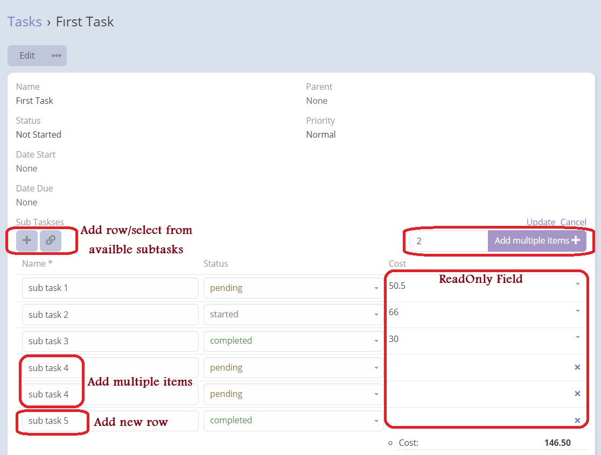
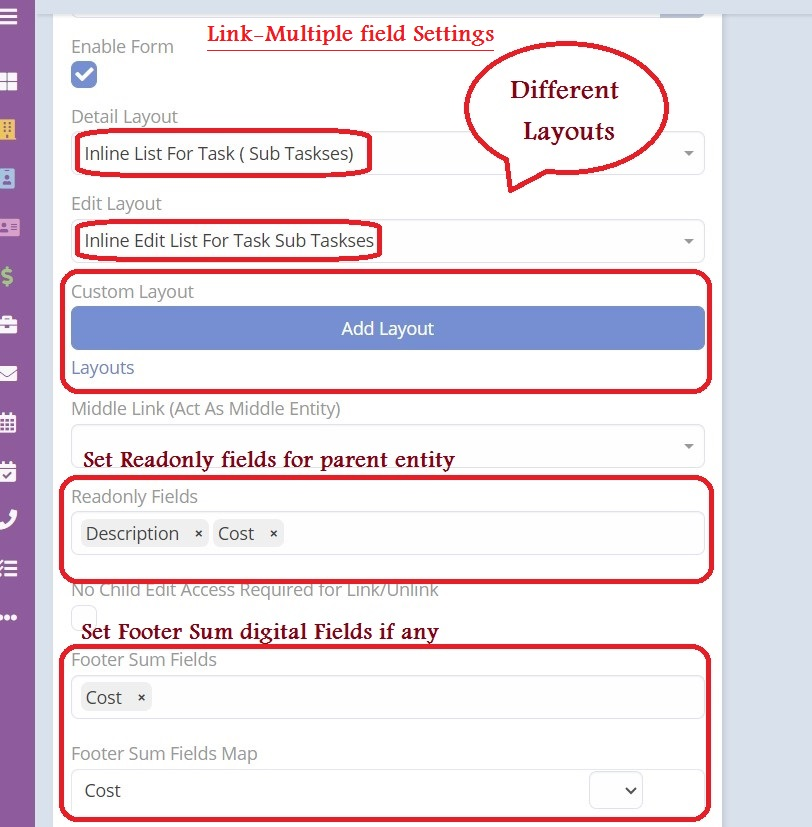
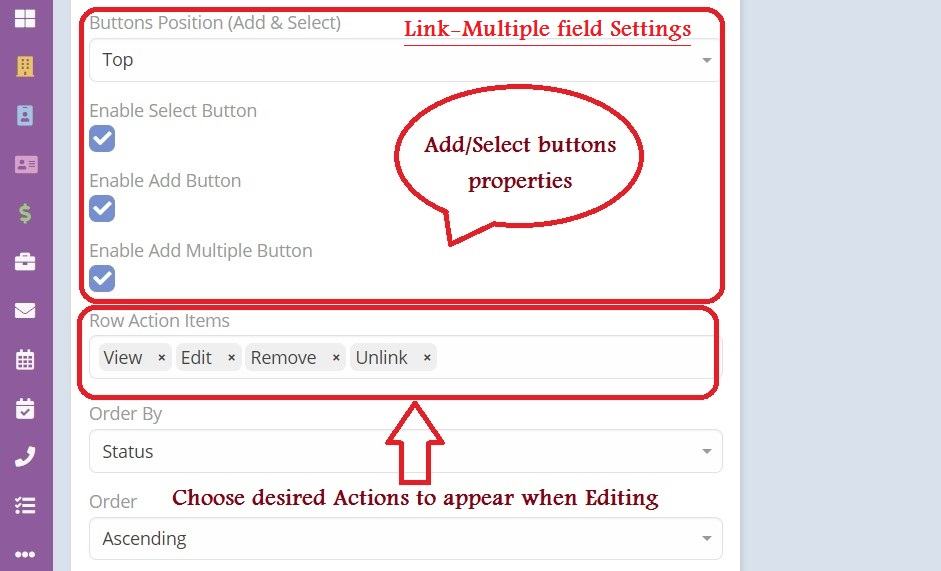

## Features

***1.*** Ability to **inline edit** directly from the inline list.

***2.*** Ability to have **additional list layouts** for the linked entity.

***3.*** Ability to have **different layouts** for edit and detail modes.

***4.*** Ability to use **"Middle Link"** which acts as middle entity.

***5.*** Ability to enable the option **"No Child Edit Access Required for Link/Unlink"**

***6.*** Ability to add **footer sum fields** when having digital fields.

***7.*** Ability to choose of the following options **"view, edit, remove, unlink"**.

> **Important Note:** For   "Many To Many"  usage cases please consider to read [this article](https://www.eblasoft.com.tr/post/link-multiple-pro-many-to-many).