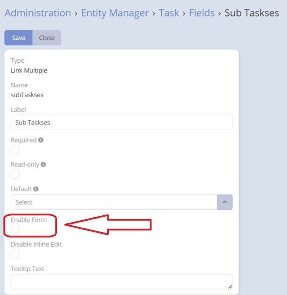

## How To Use

**1.** Create a relationship between two entities of type one-to-many. Make sure to enable the "link multiple field" option to enable this extension.

**2.** After enabling the "link multiple field" option, a new field of type "link multiple" will be added to the fields of the parent entity. You can find this field in the entity manager.

**3.** Edit the properties of the newly added multiple link field. You will now see a new option called "enable form" available.

**4-** Check the "enable form" option and configure the desired settings for this field. Once you are done, save the changes.

**5.** To verify your configuration, view the detail record of the parent entity that has this multiple link field. You should be able to see the changes you have made and interact with the multiple link field accordingly.

