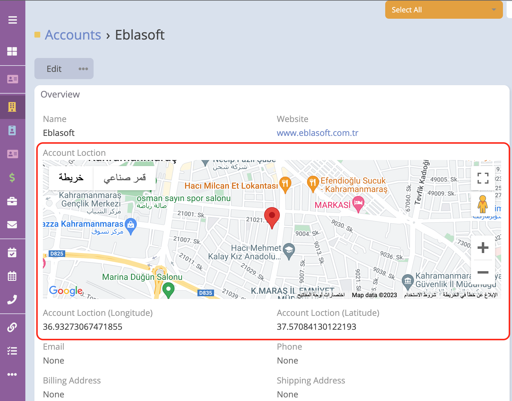
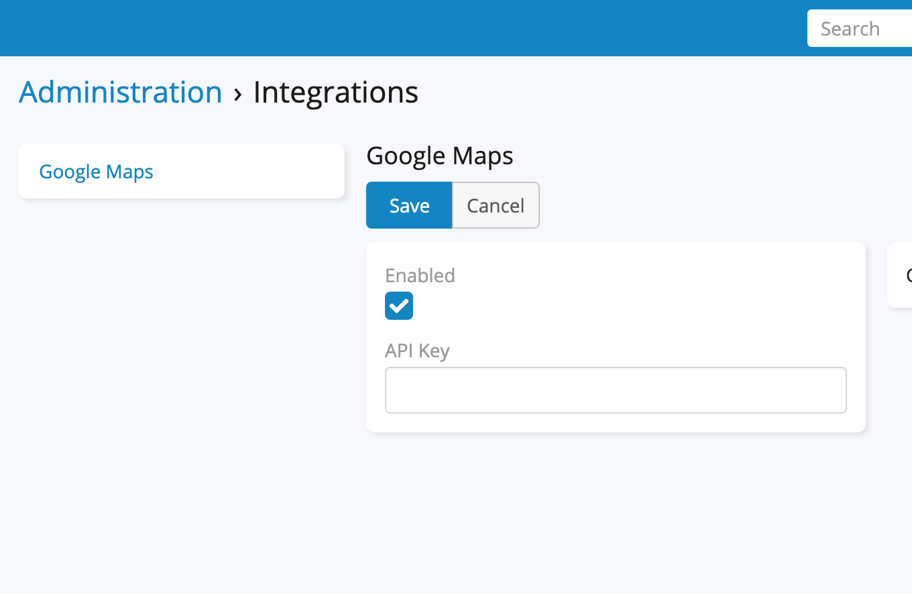

# Espocrm Ebla Location

---

<ins class= "font1" > Version:</ins> 1.1.0
<ins class= "font1" > Supported EspoCRM Versions:</ins> >=5.6.0
<ins class= "font1" > Type:</ins> paid

## Overview
> When creating a new record, the user's location is determined. The user can change the latitude and longitude through the map field, or through the latitude and longitude fields.

## Features

1. **[Add Map field for capturing location.](/extensions/ebla-location/espocrm-ebla-location-features.md?id=add-map-field-for-capturing-location)**  

2. **[Determine latitude and longitude.](/extensions/ebla-location/espocrm-ebla-location-features.md?id=determine-latitude-and-longitude)** 

## How To Use

Google Map must be enabled and the Api Key added.

 

## How to Install

You can install this extension following the steps in [EspoCRM Documentation](https://docs.espocrm.com/administration/extensions/).

---

