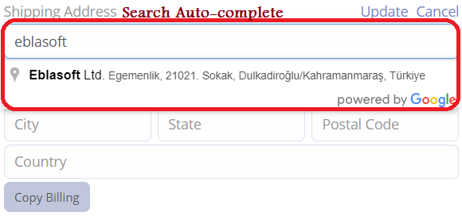

## Features

### Latitude and Longitude:
 The existing **Address** field type now includes two additional inputs, latitude and longitude. If coordinates are provided, the map will be rendered using these coordinates instead of the address line. If no coordinates are detected, the default behavior will remain the same.

### Search:
 The existing field of type **Address** now includes a search ability using [Google Places API](https://developers.google.com/maps/documentation/places/web-service/overview). Users can search for an address, and the field will populate with the selected result, filling in all the address data automatically.

### Map Route:
 Drow the **route** between two or more addresses.

### Duration and Distance:
 When using the **Map Route** field type, the system will calculate the duration and distance between several addresses picked along the route.

