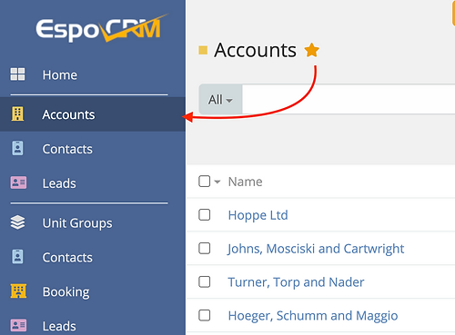

# Espocrm Ebla Nav Pro

---

<ins class= "font1" > Version:</ins> 1.9.2
<ins class= "font1" > Supported EspoCRM Versions:</ins> >=7.5.*
<ins class= "font1" > Type:</ins> paid

## Overview
> Custom Link Tabs -  Navbar customizations.

## Features

1. **[Add tabs with custom links:](/extensions/ebla-nav-pro/espocrm-ebla-nav-pro-features.md?id=add-tabs-with-custom-links)**  Add tabs with custom links to navigation menu

2. **[Open sub menu:](/extensions/ebla-nav-pro/espocrm-ebla-nav-pro-features.md?id=open-sub-menu)** - Open sub menu on mouse hover (support hover indent area for better ux).

3. **[Add favourite menu:](/extensions/ebla-nav-pro/espocrm-ebla-nav-pro-features.md?id=add-favourite-menu)** - Add favourite menu to top navigation bar (for records).

4. **[Add favourites links:](/extensions/ebla-nav-pro/espocrm-ebla-nav-pro-features.md?id=add-favourites-links)** - Add favourites links to tabs (for list screens).

5. **[Menu separator:](/extensions/ebla-nav-pro/espocrm-ebla-nav-pro-features.md?id=menu-separator)** - Menu separator.

## How to Install

You can install this extension following the steps in [EspoCRM Documentation](https://docs.espocrm.com/administration/extensions/).

---

