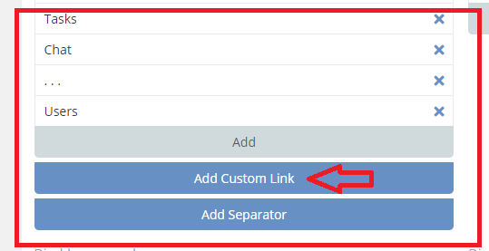
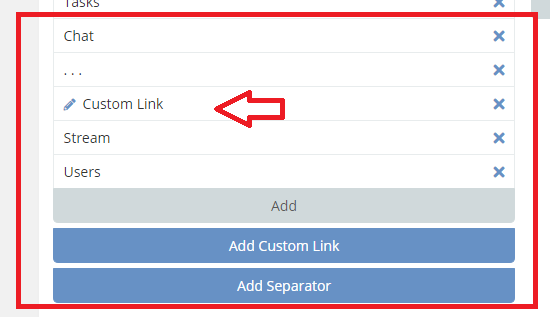
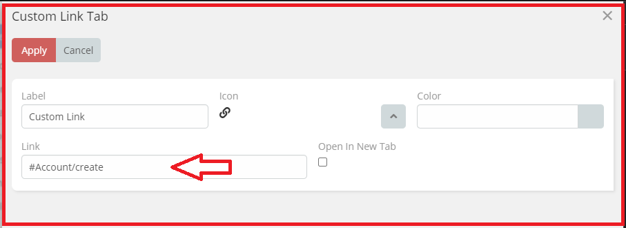
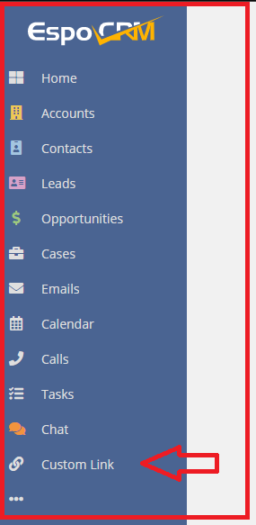

# Ebla Nav Pro. Custom Link

#### this feature enables you to add a custom link .

### How to use it

* 1.go to **Admin** -> **User Interface**->

* 2.Select **Add Custom Link**.

* 3.put custom link e.(Account/create).

### Result:

