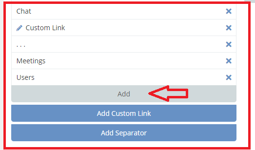
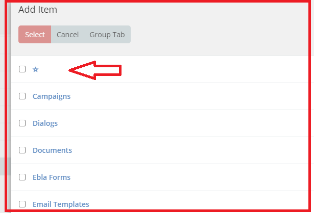
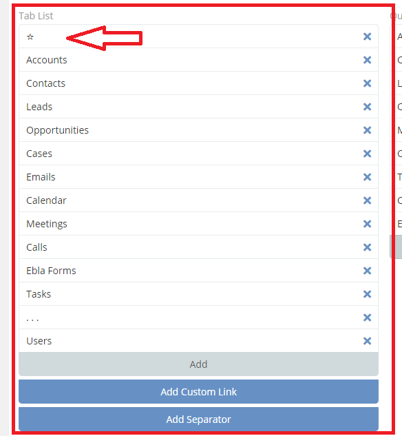
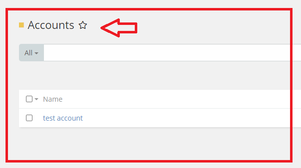
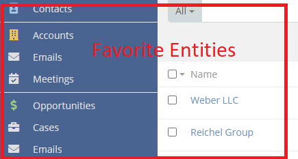

# Ebla Nav Pro. Favorite Entity

#### this feature enables you to add a favorite entity in Nav Bar.

### How to use it

* 1.go to **Admin** -> **User Interface**->

* 2.Select **Add**.

* 3.Select **Star**.

* 4.Move the **star** to the top of the table list .

* 4.Select **Entity**.

### Result:

