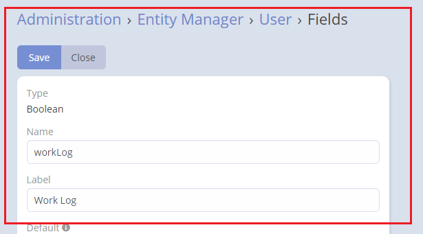
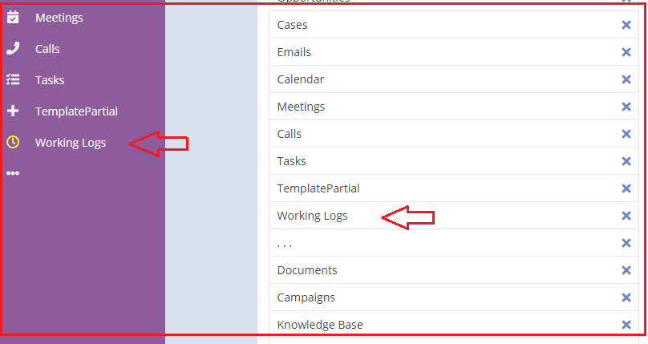
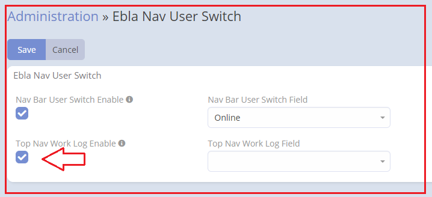
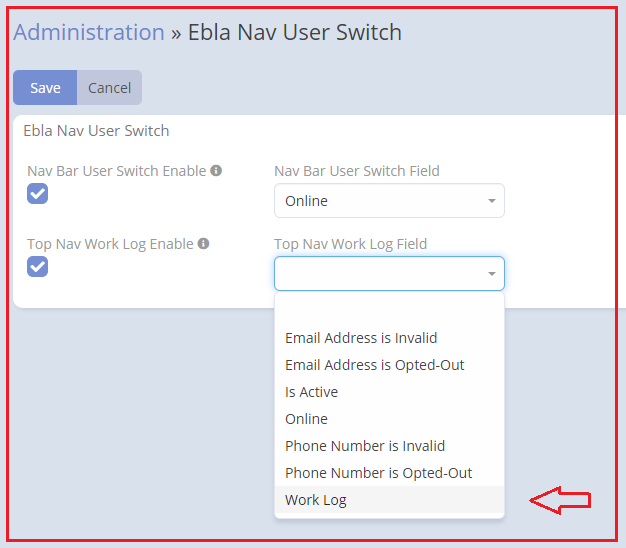
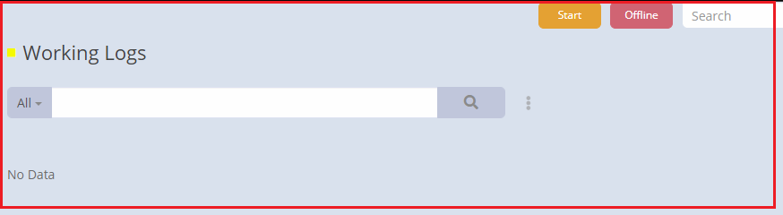
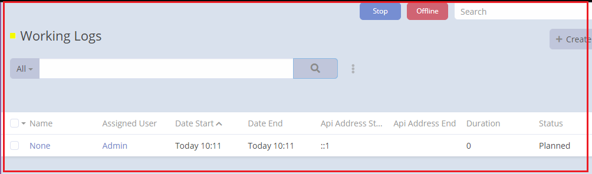
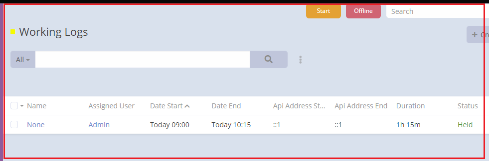

# Ebla Nav USer Switch Button . Top Nav Work Log Button

### This feature calculates the number of working hours per day.

### How to use

1. Go to **Admin** -> **Entity Manager** -> **User** -> **Fields** -> **Add Field** -> **( Boolean Type )**.

1. Go to **Admin** -> **User Interface**

2. Go to **Admin** -> **Ebla Extensions** -> **Nav Bar User Switch**.

3. Enable **Top Nav Work Log Enable**.

4. Select the **type boolean**.

### Result:

1. **Start**

**After click start**

2. **Stop**

