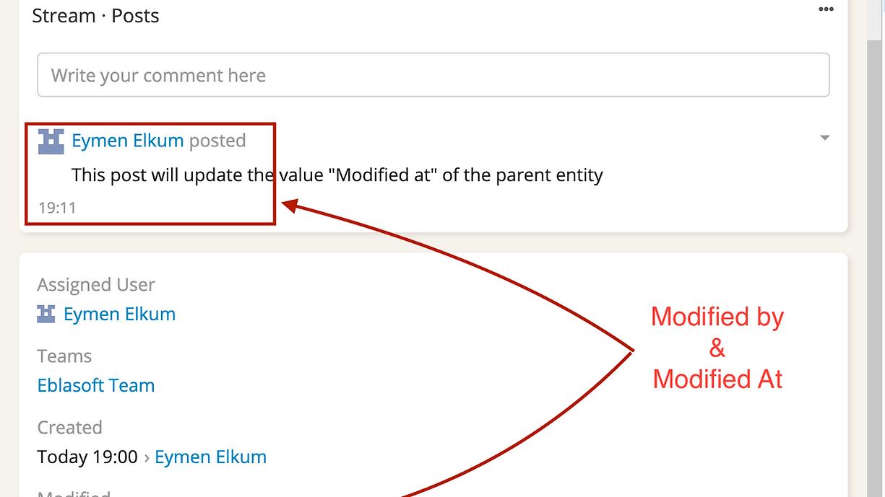

# Espocrm Stream Post Update ModifiedAt Extension {docsify-ignore-all}

---

 Version: 1.1.1 

### **Update the Modified At of the Parent Entity upon Posting on the Stream**

> With this extension, the Modified At timestamp of the parent entity will be automatically updated to the current time when a user posts on the stream

