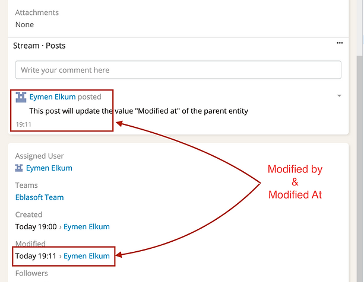

### Espocrm Stream Post Update ModifiedAt Extension {docsify-ignore-all}

---

 Version: 1.1.1 

 Type: free 

#### Description
> With this extension:
> Trigger: A user posted on a stream
> Action: The entity's **modified at** field will be updated to the current time.

#### Use Cases
- This is useful when you want to know when was the last time a user posted on the stream
- This is also useful when you want to know when was the last time a user interacted with the parent entity
- This is also useful when you want to order the parent entity by the last time a user interacted with it

