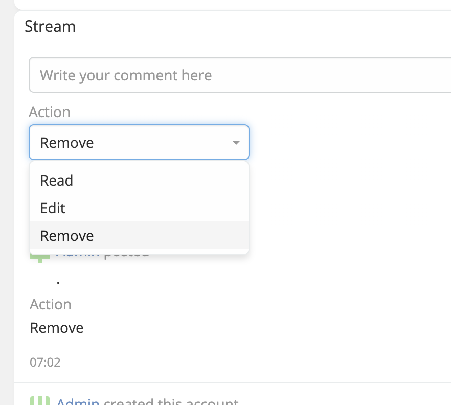

# Stream Plus 

> Ability to define custom fields for stream from entity manager in EspoCRM is available
> in [Ebla Stream Plus](https://www.eblasoft.com.tr/espocrm-extension-page/stream-plus).
>

---

---

1. go to **Admin** -> **Entity Manager** -> **Note** ->

!!! note

     Ability to create reports on Stream note entity using Advanced pack.

 

###  [ChangeLog](changelog.md) 