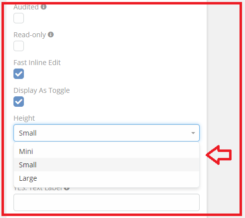
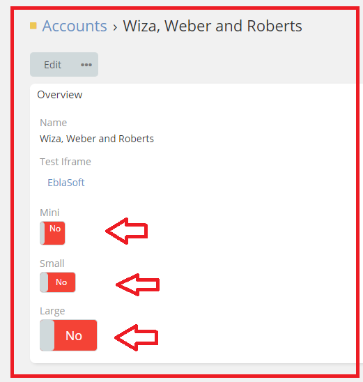

# Ebla Switch. Display As Toggle. Height

This feature allows you to customize the height of the toggle.

## How to use it

1. go to **Admin** -> **Entity Manager** -> **Scope** -> **Fields** -> **Add Field** -> **Boolean**.
2. Enable **Display As Toggle**.
3. Select **Mini - Small - Large** in the **Height** option.

## Result:

