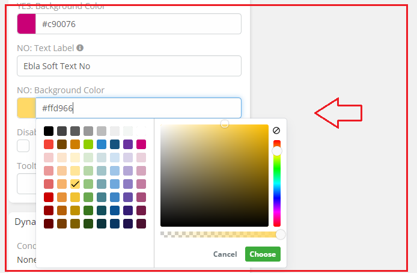
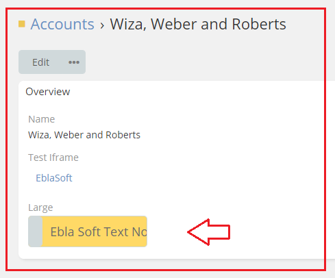

# [Ebla Switch.](../../setting-up.md) Display As Toggle. No Color

This feature allows you to customize the color of the toggle when the value is false.

## How to use it

1. go to **Admin** -> **Entity Manager** -> **Scope** -> **Fields** -> **Add Field** -> **Boolean**.
2. Enable **Display As Toggle**.
3. Select **Customize Color** in the **No Color** option.

## Result:

