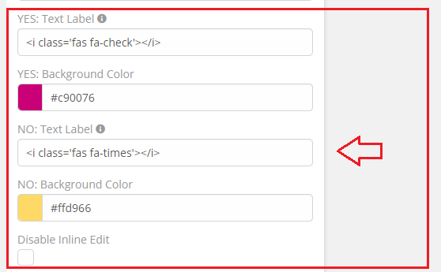
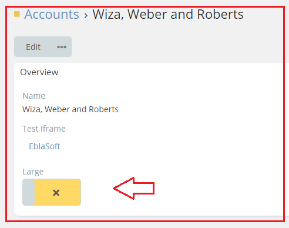

# Ebla Switch. Display As Toggle. No Icon

This feature allows you to customize the icon of the toggle when the value is false.

## How to use it

1. go to **Admin** -> **Entity Manager** -> **Scope** -> **Fields** -> **Add Field** -> **Boolean**.

2. Enable **Display As Toggle**.
3. Select **No** in the **No Label** option.

## Result:

