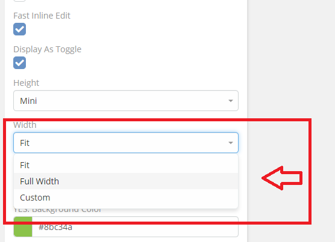
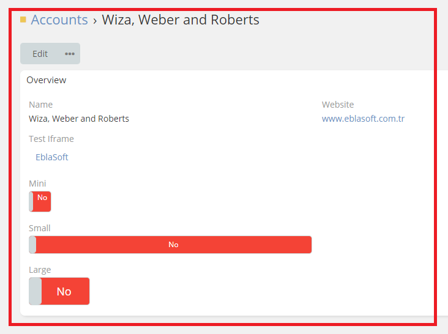

# Ebla Switch. Display As Toggle. Width

This feature allows you to customize the width of the toggle.

## How to use it

1. go to **Admin** -> **Entity Manager** -> **Scope** -> **Fields** -> **Add Field** -> **Boolean**.

2. Enable **Display As Toggle**.

3. Select **Fit - Full Width - Custom** in the **Width** option.

## Result:

