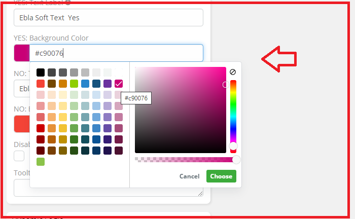
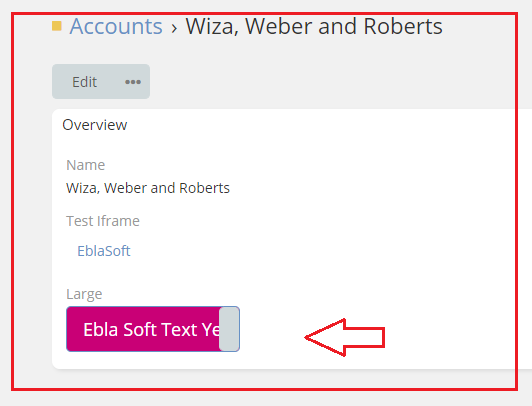

# Ebla Switch. Display As Toggle. Yes Color

This feature allows you to customize the color of the toggle when the value is true.

## How to use it

1. go to **Admin** -> **Entity Manager** -> **Scope** -> **Fields** -> **Add Field** -> **Boolean**.

2. Enable **Display As Toggle**.
3. Select **Customize Color** in the **Yes Color** option.

## Result:

