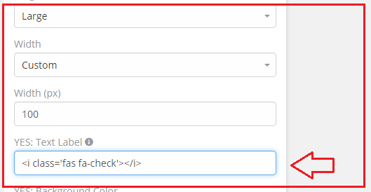
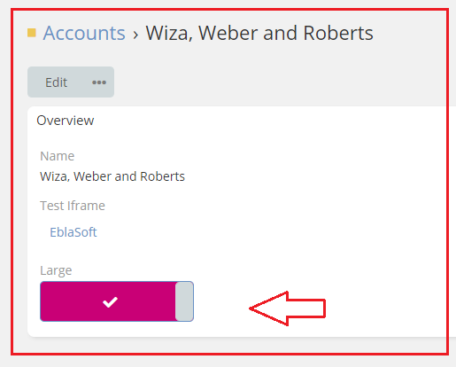

# [Ebla Switch.](../../setting-up.md) Display As Toggle. Yes Icon

This feature allows you to customize the icon of the toggle when the value is true.

## How to use it

1. go to **Admin** -> **Entity Manager** -> **Scope** -> **Fields** -> **Add Field** -> **Boolean**.

2. Enable **Display As Toggle**.

3. Select **Yes** in the **Yes Label** option.

## Result:

