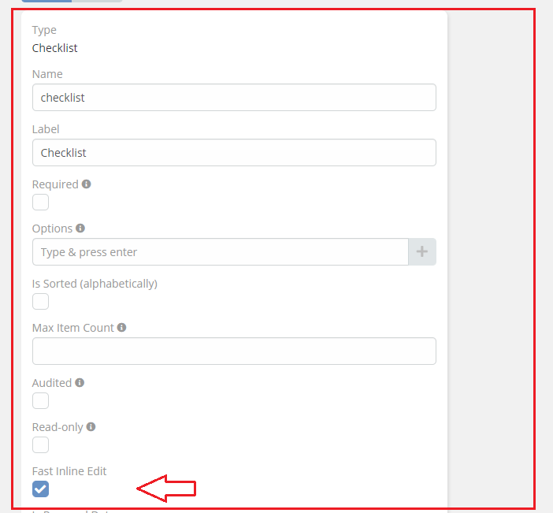

# [Ebla Switch.](../setting-up.md) Fast Inline Edit Checklist

* The Features allow you to edit the field directly from the detail view.

## How to use it

1. go to **Admin** -> **Entity Manager** -> **Scope** -> **Fields** -> **Add Field** -> **Checklist**.
2. Enable **Fast Inline Edit** option.

## Result:

