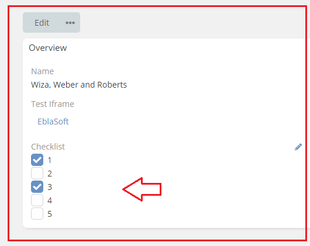

# Ebla Switch

Type: **Extension**

Safe Upgrade: **100%**

[//]: # (Demo: https://demo.espocrm.com/)

[//]: # (<iframe width="650" height="315" src="https://www.youtube.com/embed/ID" frameborder="0" allow="accelerometer; autoplay; clipboard-write; encrypted-media; gyroscope; picture-in-picture" allowfullscreen></iframe>)

This extension Add to   (boolean - checklist) fields now allows direct modification .

**Usage**:

you can edit the field directly from the detail view.

**The Features**

### **[Fast Inline Edit Boolean](fast-inline-edit-boolean/fast-inline-edit-boolean.md)**

### **Display As Toggle**

1. [Height](fast-inline-edit-boolean/display-as-toggle/height.md)
2. [Width](fast-inline-edit-boolean/display-as-toggle/width.md)
3. [Yes Text](fast-inline-edit-boolean/display-as-toggle/yes-text.md)
4. [No Text](fast-inline-edit-boolean/display-as-toggle/no-text.md)
5. [Yes Color](fast-inline-edit-boolean/display-as-toggle/yes-color.md)
6. [No Color](fast-inline-edit-boolean/display-as-toggle/no-color.md)
7. [Yes Icon](fast-inline-edit-boolean/display-as-toggle/yes-icon.md)
8. [No Icon](fast-inline-edit-boolean/display-as-toggle/no-icon.md)

### **[Fast Inline Edit Checklist](fast-inline-edit-checklist/fastinline-edit-Checklist.md)**

