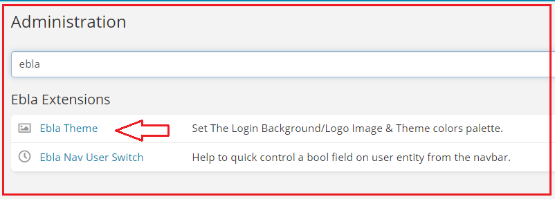
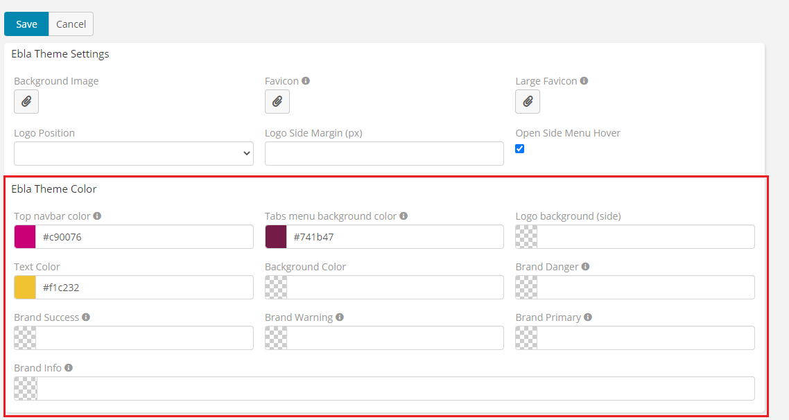
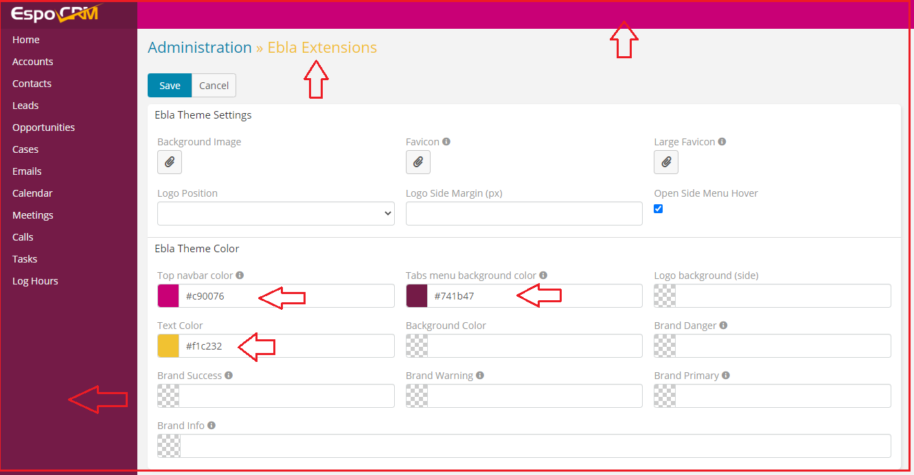

# Ebla Theme . Color Customization

## This extension allows you to customize the colors of the **EspoCRM**.

### How to use

1. Go to **Admin** -> **Ebla Extensions** -> **Ebla Theme**.

2. Select the **Ebla Theme Color **.
 
3. Select the color.

### Result:

