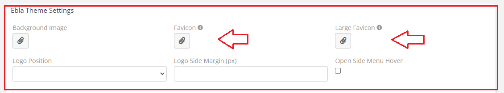
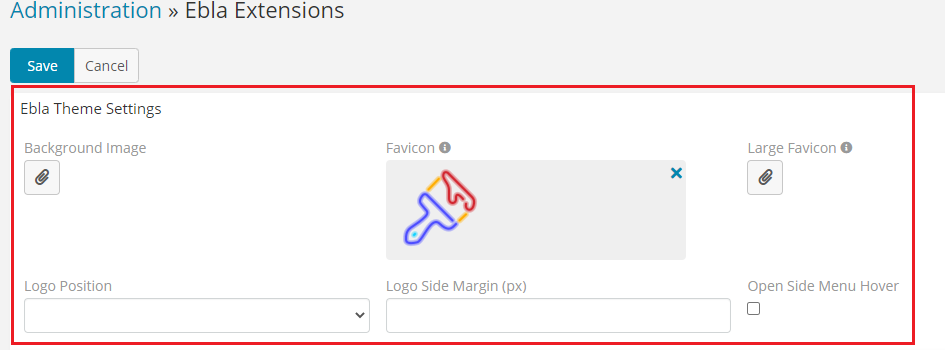

# Ebla Theme . Favicon

## the ability to upload a personalized favicon, which adds a unique, professional touch to the **EspoCRM**.

### How to use

1. Go to **Admin** -> **Ebla Extensions** -> **Ebla Theme**.

2. Select the **Favicon**.

3. Upload the image.

### Result:

