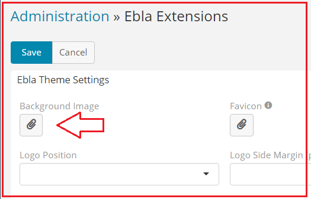
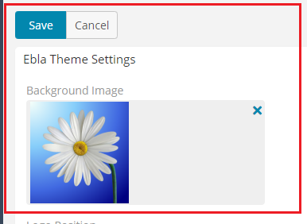

# Ebla Theme . Login Background Image

## This extension provides an enhanced user experience by enabling users to personalize their**EspoCRM** login screen with a custom background image of their choice.

### How to use

1. Go to **Admin** -> **Ebla Extensions** -> **Ebla Theme**.

2. Select the **Login Background Image**.

3. Upload the image.

### Result:

