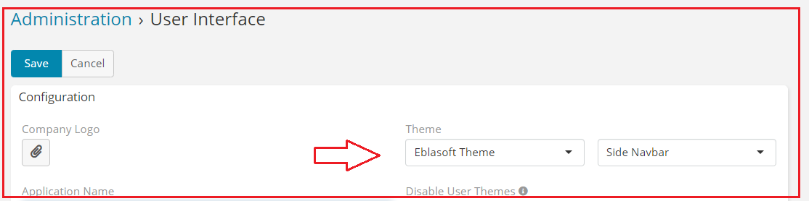
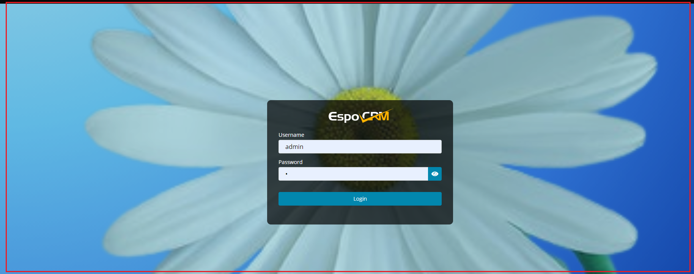
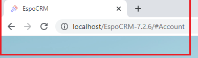

# Ebla Theme .

#### Type : Extension

[//]: # (#### Demo : [Demo]&#40;https://demo.eblasoft.com.tr/#Task/create&#41;)

* provides an enhanced user experience by enabling users to personalize their **EspoCRM** login screen with a
  custom background image of their choice.
* the ability to upload a personalized favicon, which adds a unique, professional touch to the
  **EspoCRM**.
* This extension also includes the feature of opening the side menu on hover, allowing for convenient navigation.
* includes the ability to customize the colors of the EspoCRM, providing an even more personalized experience.

[//]: # (<iframe width="650" height="315" src="https://www.youtube.com/embed/ID" frameborder="0" allow="accelerometer; autoplay; clipboard-write; encrypted-media; gyroscope; picture-in-picture" allowfullscreen></iframe>)

#### after installing the extension,

1. go to **Admin** -> **User Interface** -> **Select Eblasoft Theme** .

### The Features

1. [Login Background Image](login-background-image/login-background-image.md)

2. [Favicon](favicon/favicon.md)

3. [Side Menu](side-menu/side-menu.md)

4. [Color Customization](color-customization/color-customization.md)

