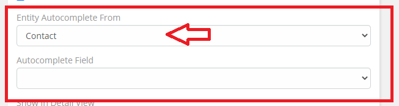
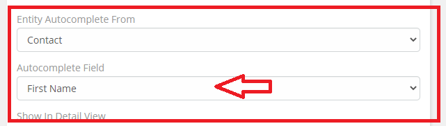
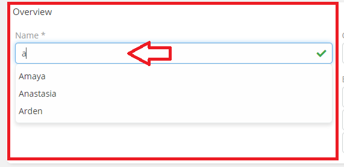

# Ebla VarChar Plus . Auto Complete

## The Feature allows for the automatic completion of chosen fields.

### How to use

1. Go to **Admin** -> **Entity Manager** -> **Scope** -> **Fields** -> **Add Field** -> **( Varchar Type )**.

2. Select the **Entity Autocomplete From** option.

3. Select the **Autocomplete Field** option.

### Result:

