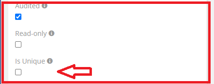
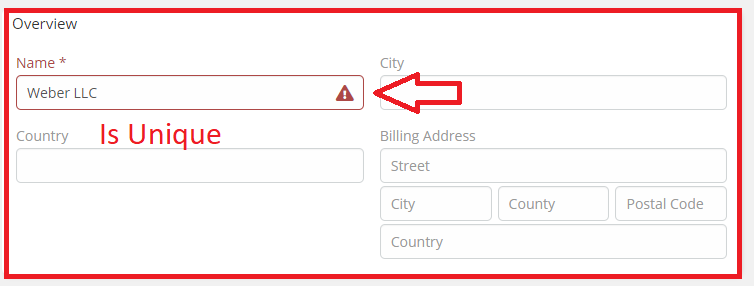
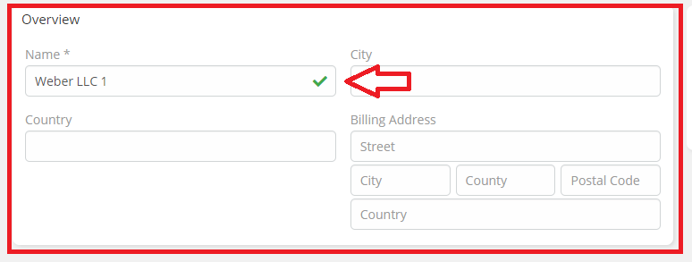

# Ebla VarChar Plus . Is Unique

## The Feature facilitates the checking of duplicate items within the database.

### How to use

1. Go to **Admin** -> **Entity Manager** -> **Scope** -> **Fields** -> **Add Field** -> **( Varchar Type )**.

2. Enable the **Is Unique** option.

### Result:

