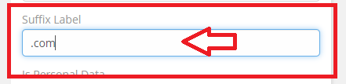
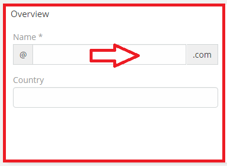

# Ebla VarChar Plus . suffix Label

## This addition allows adding details at the end of the field .

### How to use

1. Go to **Admin** -> **Entity Manager** -> **Scope** -> **Fields** -> **Add Field** -> **( Varchar Type )**.

2. Type **The suffix Label** that will be at the end of the field.

### Result:

