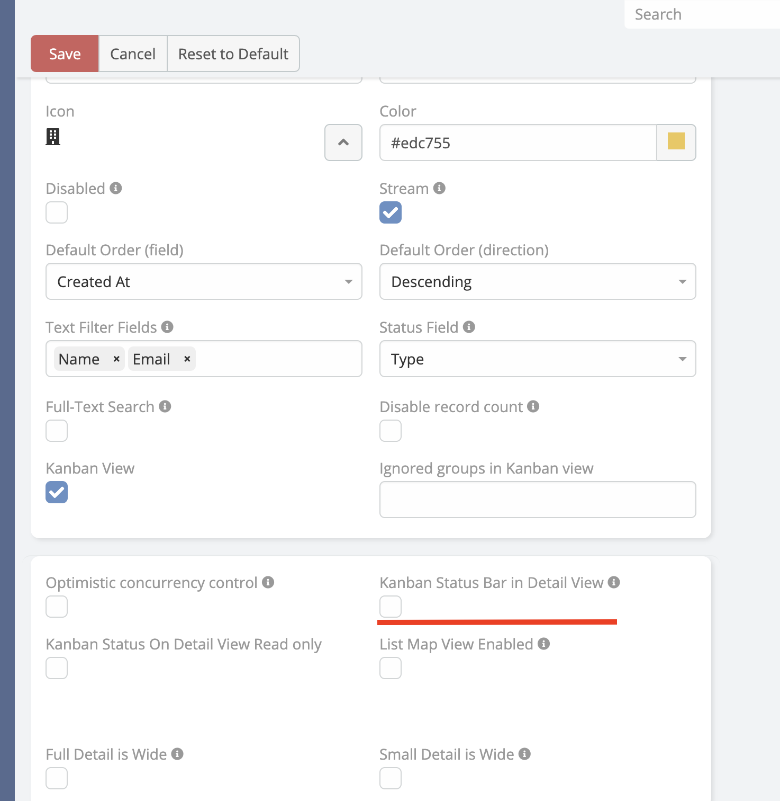

# Kanban Status Bar in Detail View

Ability to show kanban Status Field view in detail view in EspoCRM.

Kanban Status Bar in Detail View is available
in [Ebla Eum Plus](https://www.eblasoft.com.tr/espocrm-extension-page/espocrm-kanban-board).

---

---

### Enable Kanban Status Bar in Detail View

 

Go to **Administration**-> **Entity Manager** -> **{Entity Type}** -> **Edit** .

 

