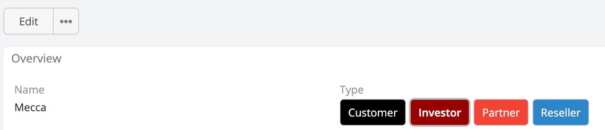

# Show As Button

Ability to transform items into buttons .

Show As Button is available in [Ebla Eum Plus](https://www.eblasoft.com.tr/espocrm-extension-page/espocrm-enum-plus).

---

### Enable Show As Button

Go to **Administration** -> **Entity Manager** -> **{Entity Type}** -> **Fields** .

### Always Force Edit Mode

Enable the toggle buttons group even on the view mode.

 

** [Changelog](changelog.md) **