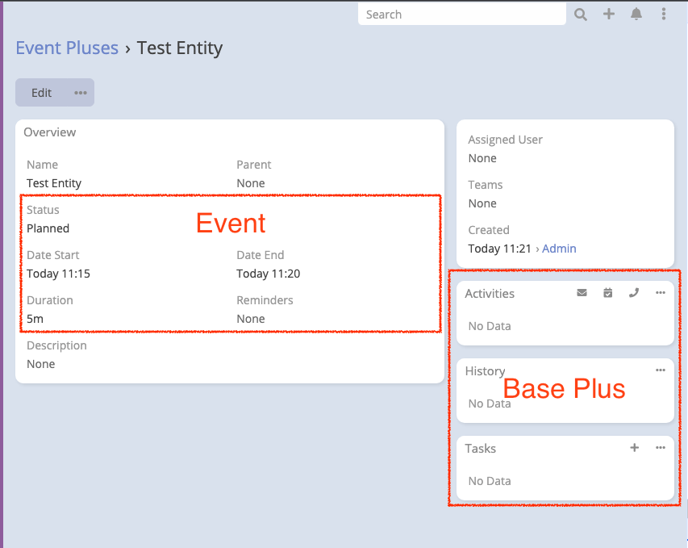

# Event Plus 

> New Entity Template "Event Plus" that have Event and BasePlus features together is available
> in [Ebla Event Plus](https://www.eblasoft.com.tr/espocrm-extension-page/espocrm-ebla-event-plus).

---

---

1. Go to **Administration** -> **Entity Manager** -> **Create Entity** -> **Event Plus**.

 

** [Changelog](changelog.md) **

