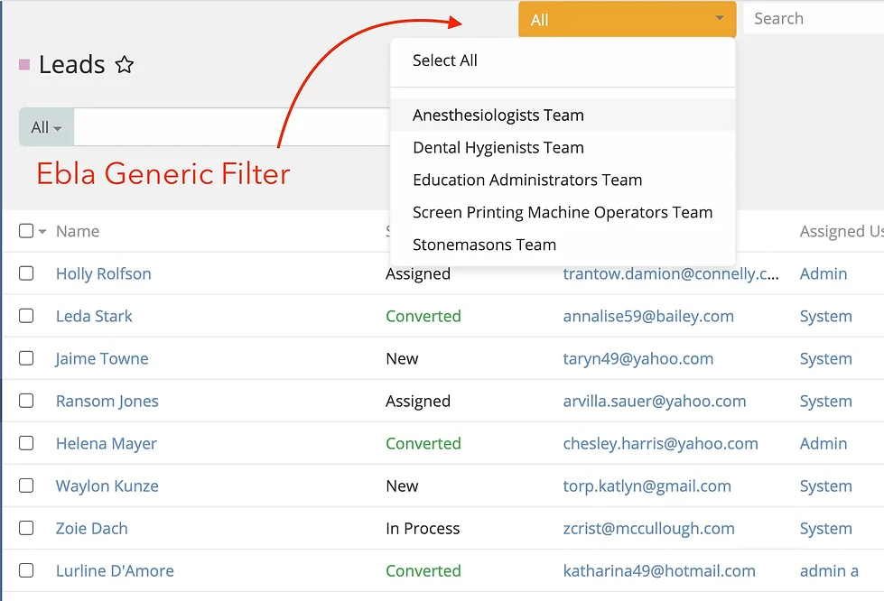
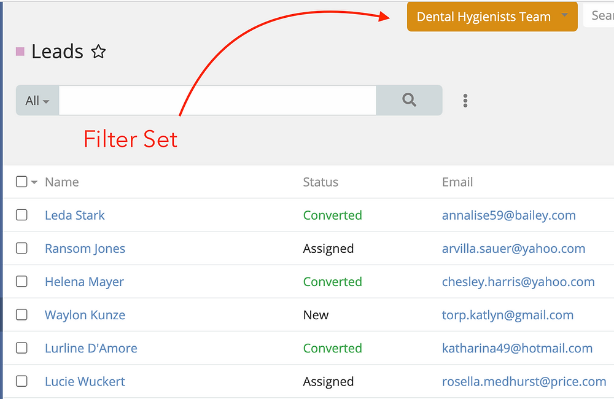
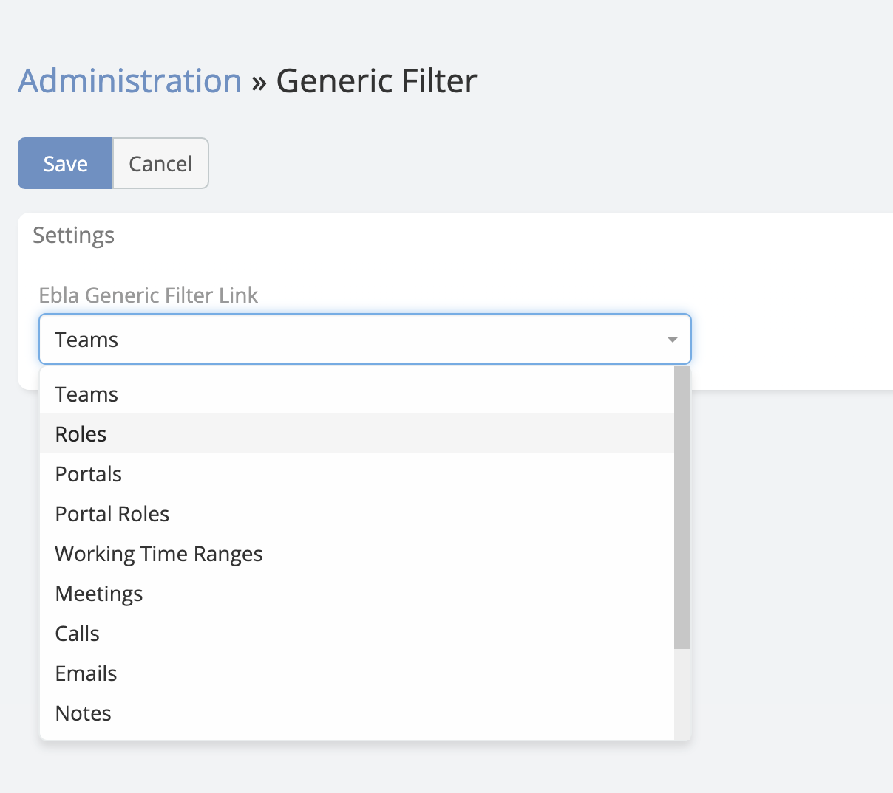

# Overview

> With features such as an additional global filter and a dropdown switch on the navbar,
> you can easily filter records based on user's link items.
> You can switch to different Project, Organisation, Team or whatever in one click.
> New created entities will automatically link to the global selected filter.
> User can easily switch it off on the fly from the drop-down.

---

<iframe width="650" height="315" src="https://www.youtube.com/embed/LBd3PhjZg" frameborder="0" allow="accelerometer; autoplay; clipboard-write; encrypted-media; gyroscope; picture-in-picture" allowfullscreen></iframe>

go to **Administration** > **Generic Filter Settings** > **Generic Filter** > **Settings**.

